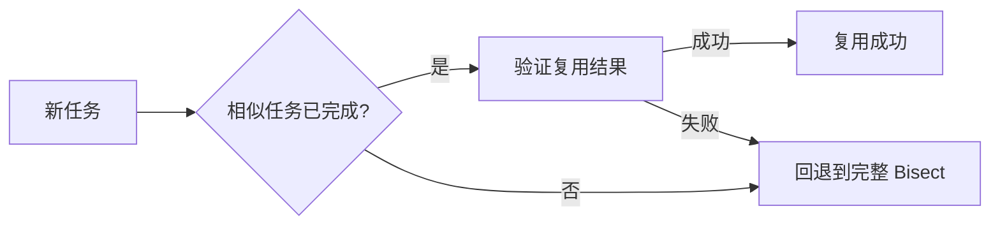
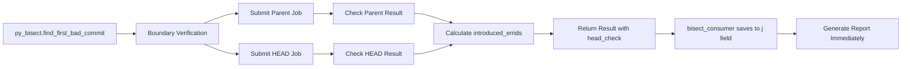
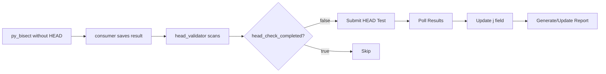
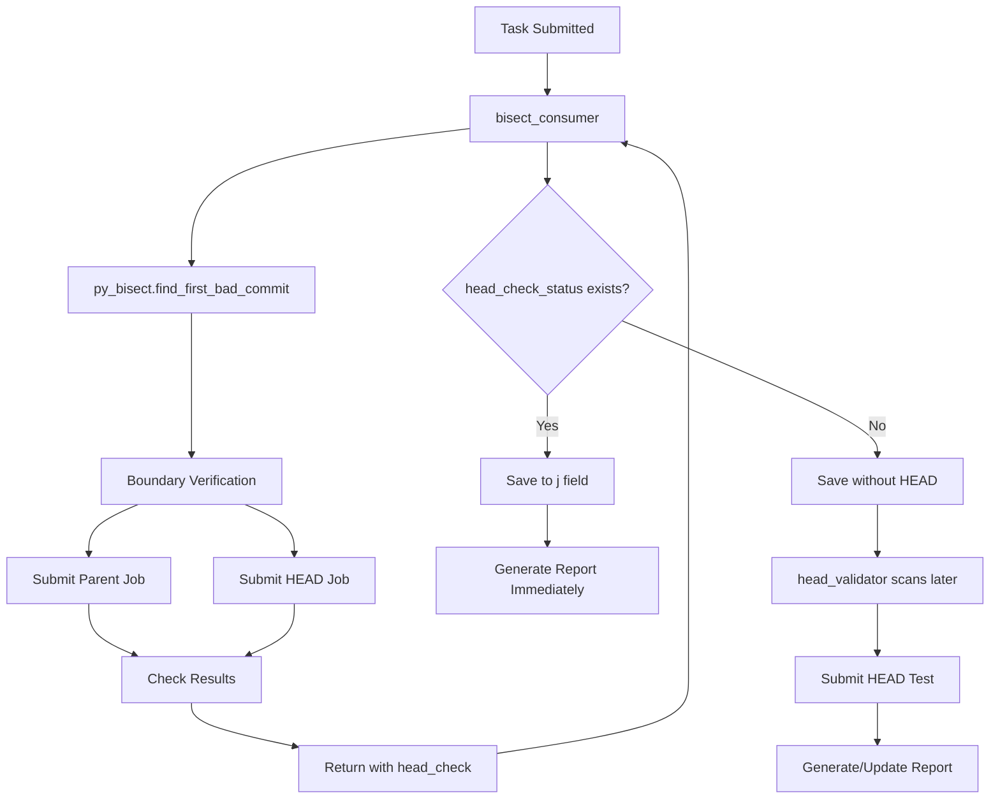

# Bisect 算法文档

## 1. 概述

Bisect 算法是 Bisect 系统的核心，用于自动化地定位引入问题的第一个坏提交 (First Bad Commit)。本文档详细描述了 Bisect 算法的设计目标、流程、数据结构、特定场景的优化以及使用案例。

---

## 2. 一般性设计目标

1.  **准确性 (Accuracy)**: 能够准确地找到导致问题的第一个提交，尽可能排除环境噪声和无关因素的干扰。
2.  **效率 (Efficiency)**: 通过二分查找算法 (Binary Search) 最小化测试次数，快速定位问题。
3.  **鲁棒性 (Robustness)**: 能够处理各种异常情况，如编译失败、测试超时、环境问题等，并具备自动恢复能力。
4.  **自动化 (Automation)**: 整个过程尽可能自动化，减少人工干预。
5.  **可复用性 (Reusability)**: 对于相似的问题，能够复用已有的 Bisect 结果，避免重复计算。

---

## 3. Bisect 流程

### 3.1 总体流程图

```mermaid
graph TD
    A[开始 Bisect] --> B{是否有已知好提交?};
    B -- 是 --> C[设置 Good Commit];
    B -- 否 --> D[寻找 Good Commit];
    D --> E{找到 Good Commit?};
    E -- 是 --> C;
    E -- 否 --> F[Bisect 失败: 无法确定范围];
    C --> G[开始二分查找];
    G --> H{还有待测试提交?};
    H -- 否 --> I[Bisect 完成];
    H -- 是 --> J[选择中间提交 (Mid Commit)];
    J --> K[测试 Mid Commit];
    K --> L{测试结果?};
    L -- Good --> M[标记为 Good, 范围缩小到 [Mid, Bad]];
    L -- Bad --> N[标记为 Bad, 范围缩小到 [Good, Mid]];
    L -- Skip --> O[跳过该提交, 重新选择];
    M --> H;
    N --> H;
    O --> H;
    I --> P{找到 First Bad Commit?};
    P -- 是 --> Q[验证结果 (Verification)];
    P -- 否 --> R[Bisect 失败: 未找到];
    Q --> S{验证通过?};
    S -- 是 --> T[Bisect 成功];
    S -- 否 --> U[Bisect 失败: 验证不通过];
```

### 3.2 详细步骤

1.  **初始化 (Initialization)**:
    *   接收任务请求，包含 `bad_job_id` (坏作业 ID) 和 `error_id` (错误 ID)。
    *   获取代码仓库 (Git Repository)。
    *   确定 `bad_commit` (坏提交)。

2.  **确定范围 (Determine Range)**:
    *   如果请求中提供了 `good_commit` (好提交)，直接使用。
    *   如果没有提供，尝试通过历史记录或特定策略 (如回退 N 个版本) 寻找一个 `good_commit`。
    *   验证 `good_commit` 确实是好的 (不复现问题)。

3.  **二分查找 (Binary Search)**:
    *   在 `good_commit` 和 `bad_commit` 之间选择一个中间提交 `mid_commit`。
    *   在该提交上构建并运行测试。
    *   根据测试结果更新范围：
        *   **Good**: 问题未复现，说明坏提交在 `[mid_commit, bad_commit]` 之间。将 `mid_commit` 设为新的 `good_commit`。
        *   **Bad**: 问题复现，说明坏提交在 `[good_commit, mid_commit]` 之间。将 `mid_commit` 设为新的 `bad_commit`。
        *   **Skip**: 测试无法运行 (如编译失败、无关错误)，跳过该提交，尝试附近的提交。

4.  **结果验证 (Verification)**:
    *   找到疑似 `first_bad_commit` 后，进行边界验证。
    *   验证 `first_bad_commit` 确实是 Bad。
    *   验证 `first_bad_commit^` (父提交) 确实是 Good。
    *   (可选) 检查 `first_bad_commit` 修改的文件是否与 `error_id` 相关。

5.  **报告生成 (Reporting)**:
    *   生成 Bisect 报告，包含 `first_bad_commit`、提交信息、引入的错误 ID 等。
    *   通知相关人员或系统。

---

## 4. 数据结构与算法

### 4.1 核心数据结构

#### Bisect 任务

```json
{
  "id": 12345,
  "bad_job_id": "25102209094235200",
  "error_id": "stderr.compilation_error:undefined_reference",
  "git_url": "https://github.com/torvalds/linux.git",
  "bisect_status": "processing",
  "first_bad_commit": "",
  "j": {
    "good_commit": "abc123...",
    "verification_status": "pending"
  }
}
```

#### 测试结果

```python
class TestResult:
    GOOD = "good"
    BAD = "bad"
    SKIP = "skip"
    UNKNOWN = "unknown"
```

### 4.2 算法实现

核心算法基于 Git 的 `git bisect` 命令，但在其之上封装了自动化的测试执行和结果判定逻辑。

#### 伪代码

```python

```

---

## 5. 特定场景的需求与优化

### 5.1 任务降频与结果复用

**场景**: 多个 `bad_job_id` 可能由同一个 `commit` 引入的相同 `error_id` 导致。

**优化**:
1.  **任务聚类**: 将具有相同 `error_id` (或相似特征) 的任务聚类。
2.  **代表任务**: 每类任务只选一个“代表任务”进行完整 Bisect。
3.  **结果复用**: 代表任务成功后，其他相似任务直接进行验证 (Verification)，如果验证通过，则复用代表任务的 `first_bad_commit`。

**流程**:



### 5.2 批量验证 (Batch Verification)

**场景**: 需要验证大量相似任务的复用结果。

**优化**:
1.  **共享仓库**: 所有验证任务复用同一个 Git 仓库，避免重复克隆。
2.  **并行提交**: 并行提交验证作业 (Parent Commit 和 Candidate Commit)。
3.  **自动清理**: 遇到 Git 错误时自动清理共享仓库，防止状态污染。

### 5.3 Makepkg 错误处理

**场景**: 编译错误多种多样，有些不适合 Bisect (如环境问题)。

**优化**:
1.  **分层过滤**:
    *   **Suite 级别**: 针对 `makepkg` 等特定 Suite 应用专门的过滤规则。
    *   **内容级别**: 过滤已知的环境错误、工具链警告等。
2.  **白名单**: 允许包含源代码路径的 `stderr` 错误通过，防止误杀。

### 5.4 仓库管理优化

**场景**: 频繁克隆大仓库 (如 Linux Kernel) 耗时且占用空间。

**优化**:
1.  **Pristine 仓库**: 维护一个干净的镜像仓库。
2.  **Reference Clone**: 使用 `git clone --reference` 创建轻量级工作区。
3.  **原子移动**: 任务结束后，将工作区原子移动 (mv) 回池中复用 (或直接删除，视策略而定)。

---

## 6. Bisect 过程、结果及报告

### 6.1 Bisect 过程记录

系统会详细记录 Bisect 的每一步操作，包括：
*   测试的 Commit
*   测试结果 (Good/Bad/Skip)
*   耗时
*   日志链接

### 6.2 Bisect 结果

成功的 Bisect 会产出：
*   **First Bad Commit**: 引入问题的第一个提交。
*   **Commit Info**: 作者、时间、提交信息。
*   **Error Diff**: 该提交引入的具体错误 ID 列表。

### 6.3 报告示例 (Kernel Test Robot 风格)

```text
tree:   https://github.com/torvalds/linux.git master
head:   a1b2c3d4e5f6...
commit: f7e8d9c0a1b2... (First Bad Commit)
config: x86_64-randconfig-a001
compiler: gcc-9

=============================
compiler/kconfig bisected range:

  abcdef123456... <config> GOOD
  f7e8d9c0a1b2... <config> BAD

=============================
detailed bisect info:

  Start:      abcdef123456...
  End:        f7e8d9c0a1b2...
  Bisected:   12 times

=============================
metadata:

  error_id: stderr.compilation_error:undefined_reference
  bad_job_id: 25102209094235200
  introduced_errids: [
    "stderr.compilation_error:undefined_reference"
  ]

=============================
reproduce:

  # 1. clone repository
  git clone https://github.com/torvalds/linux.git
  cd linux

  # 2. checkout commit
  git checkout f7e8d9c0a1b2...

  # 3. build
  make config=x86_64-randconfig-a001
```

### 6.4 案例

#### 案例 1：标准编译错误 Bisect

*   **Error ID**: `stderr.compilation_error:variable_undeclared`
*   **过程**:
    1.  找到 Good Commit (昨天成功的构建)。
    2.  Bisect 10 步。
    3.  定位到 Commit X，该 Commit 删除了一个变量定义。
*   **结果**: 成功找到原因。

#### 案例 2：结果复用

*   **任务 A**: `bad_job_id=1001`, `error_id=E1`。完整 Bisect 找到 Commit Y。
*   **任务 B**: `bad_job_id=1002`, `error_id=E1`。
*   **过程**:
    1.  发现任务 B 与 A 相似。
    2.  验证 Commit Y 在任务 B 的环境中是否复现 E1，且 Commit Y^ 不复现。
    3.  验证通过。
*   **结果**: 任务 B 直接复用 Commit Y，耗时从 1 小时缩短到 5 分钟。

---

## 7. HEAD 回归检测机制

### 7.1 概述

HEAD 回归检测是在 Bisect 完成后，检查已知问题在最新 HEAD commit 上是否仍然存在的机制。这有助于：
- 及时发现问题回归
- 确认问题是否已在主线修复
- 避免对已修复问题的重复报告

### 7.2 两种 HEAD 检测流程

系统支持两种 HEAD 检测流程，避免重复测试：

#### 流程 1：集成式 HEAD 检测（py_bisect 内置）



**特点**：
- py_bisect 在边界验证时自动提交 HEAD 测试
- 结果包含在 `boundary_verification['head_check']` 中
- consumer 提取并保存到数据库 j 字段
- 立即生成包含 HEAD 状态的报告
- head_validator 会跳过这些任务（通过 `head_check_completed=true` 标记）

**数据结构**：
```python
# py_bisect 返回值
result = {
    'first_bad_commit': 'abc123... (commit subject)',
    'boundary_verification': {
        'introduced_errids': [...],
        'errid_log_context': {
            'ltp.eid.test.fail': 'TFAIL: test failed...'
        },
        'head_check': {
            'status': 'regressed',  # or 'fixed'
            'head_commit': 'xyz789...',
            'regressed_errids': [...]
        },
        'head_job_id': '12345'
    }
}

# consumer 保存到 j 字段
j_field = {
    'head_check_status': 'regressed',
    'head_check_commit': 'xyz789...',
    'head_check_job_id': '12345',
    'head_check_source': 'py_bisect',
    'head_check_completed': true,
    'regressed_errids': [...],
    'errid_log_context': {...}
}
```

#### 流程 2：独立式 HEAD 检测（head_validator 补充）



**特点**：
- 用于旧版 py_bisect 或 HEAD 检测失败的任务
- head_validator 定期扫描 `head_check_completed=false` 的任务
- 独立运行 HEAD 测试并生成报告
- 支持状态变化检测和增量验证

**查询条件**（head_validator.py:92-105）：
```sql
SELECT * FROM bisect
WHERE j.verification_status = 'verified'
  AND j.introduced_errids IS NOT NULL
  AND (j.head_check_completed IS NULL OR j.head_check_completed = 0)
  AND (j.head_check_status IS NULL OR j.head_check_status NOT IN ('failed', 'regressed', 'fixed'))
ORDER BY updated_at ASC
```

### 7.3 统一的 j 字段结构

为了保证两种流程的一致性，j 字段使用统一命名：

**通用字段**（py_bisect 和 head_validator 都使用）：
```python
{
    'head_check_status': str,        # 'good', 'bad', 'regressed', 'fixed', 'checking', 'failed'
    'head_check_commit': str,        # HEAD commit hash (12 chars)
    'head_check_job_id': str,        # 作业 ID
    'head_check_at': int,            # 检测时间戳
    'head_check_source': str,        # 'py_bisect' or 'head_validator'
    'regressed_errids': list         # 回归的错误 ID 列表
}
```

**py_bisect 特有字段**：
```python
{
    'head_check_completed': bool,    # 标记 py_bisect 是否完成了 HEAD 检测
    'errid_log_context': dict        # errid -> 错误日志原文的映射
}
```

**head_validator 特有字段**：
```python
{
    'head_check_verified': bool,             # 是否经过验证
    'head_check_status_changed': bool,       # 状态是否变化
    'head_check_submitted_at': int,          # 提交时间（异步模式）
    'head_check_completed_at': int,          # 完成时间
    'head_check_failure_reason': str,        # 失败原因
    'head_check_failed_at': int              # 失败时间
}
```

### 7.4 案例：避免重复 HEAD 检测

**场景**：task_id=5107 完成 bisect，py_bisect 已经做了 HEAD 检测。

**执行流程**：

1. **py_bisect 完成**（约 1 小时）
   ```python
   # py_bisect.py 返回
   result['boundary_verification']['head_check'] = {
       'status': 'regressed',
       'head_commit': '78f0e33cd6c9',
       'regressed_errids': ['ltp.eid.test.fail']
   }
   ```

2. **consumer 提取并保存**（bisect_consumer.py:459-527）
   ```python
   # 提取 HEAD 结果
   head_check = boundary_verification.get('head_check') or {}
   head_check_status = head_check.get('status')  # 'regressed'

   # 保存到 j 字段
   success_doc['j']['head_check_status'] = 'regressed'
   success_doc['j']['head_check_completed'] = True
   success_doc['j']['head_check_source'] = 'py_bisect'
   ```

3. **立即生成报告**（bisect_consumer.py:559-597）
   ```python
   if head_check_status:  # 'regressed'
       # py_bisect 已完成 HEAD 检测，立即生成报告
       report_path = self.notification_writer.write_bisect_success_report(
           updated_task, job_info, introduced_errids
       )
   ```

4. **head_validator 跳过**（head_validator.py:96）
   ```python
   # 查询条件排除已完成的任务
   WHERE (j.head_check_completed IS NULL OR j.head_check_completed = 0)
   # task_id=5107 的 head_check_completed=True，被跳过
   ```

**结果**：节省了重复 HEAD 测试（约 10 分钟），立即生成报告。

---

## 8. 报告生成机制

### 8.1 报告格式规范

Bisect 成功报告遵循 Kernel Test Robot 风格，包含以下关键信息：

**头部摘要**：
```text
tree:   git://example.com/linux.git master
head:   78f0e33cd6c9 (regressed)
commit: 78f0e33cd6c939a555aa80dbed2fec6b333a7660 (Add new feature to XYZ)
```

**格式要求**：
- `head`: 显示 commit hash (12 chars) + 状态（regressed/fixed）
- `commit`: 显示完整 hash + commit subject（py_bisect 自动提供）
- `errid`: 显示错误日志原文，而不是 errid 本身

### 8.2 errid 日志上下文

**问题**：`ltp.eid.munlockall01.fail` 这样的 errid 对用户不友好，难以理解错误原因。

**解决方案**：py_bisect 在 boundary_verification 中提供 `errid_log_context`：

```python
# py_bisect 返回
boundary_verification = {
    'introduced_errids': [
        'ltp.eid.munlockall01.fail',
        'ltp.eid.listmount04.fail'
    ],
    'errid_log_context': {
        'ltp.eid.munlockall01.fail': 'TFAIL: munlock() failed, errno=1 (Operation not permitted)',
        'ltp.eid.listmount04.fail': 'TFAIL: listmount() returned unexpected value: -1'
    }
}
```

**报告显示**（notification_writer.py:747-762）：
```text
Introduced Error IDs (2 total):
--------------------------------------------------------------------------------
1. munlockall01.fail: TFAIL: munlock() failed, errno=1 (Operation not permitted)
2. listmount04.fail: TFAIL: listmount() returned unexpected value: -1
```

**实现**（notification_writer.py:739-762）：
```python
# 获取 errid_log_context
errid_log_context = j_field.get('errid_log_context', {})

for i, errid in enumerate(filtered_errids[:10], 1):
    if errid in errid_log_context:
        log_msg = errid_log_context[errid]
        # 去除前缀，显示日志原文
        errid_short = errid.split('.')[-1]
        content += f"{i}. {errid_short}: {log_msg}\n"
    else:
        # 回退：显示完整 errid
        content += f"{i}. {errid}\n"
```

### 8.3 过滤 .msg 后缀的 errid

**问题**：`stderr.msg.FAILED_COMMAND_...` 这样的 .msg 项是系统生成的元数据，不应显示在报告中。

**解决方案**（notification_writer.py:737）：
```python
# 过滤掉 .msg 后缀的 errid
filtered_errids = [e for e in introduced_errids if not e.endswith('.msg')]
```

### 8.4 完整报告案例

```text
tree:   git://172.168.131.113:9418/new-upstream/l/linux/linux-next.git master
head:   78f0e33cd6c9 (regressed)
commit: 78f0e33cd6c939a555aa80dbed2fec6b333a7660 (mm: add new memory allocation strategy)

================================================================================
Bisect Report - 20251201
================================================================================

Task ID:     5107454252595510347
Bad Job ID:  25112012334404900

Test Suite:  ltp
Test Case:   N/A
Architecture: aarch64

Error ID:
ltp.eid.listmount04.fail

First Bad Commit:
78f0e33cd6c939a555aa80dbed2fec6b333a7660 (mm: add new memory allocation strategy)

Introduced Error IDs (4 total):
--------------------------------------------------------------------------------
1. munlockall01.fail: TFAIL: munlock() failed, errno=1 (Operation not permitted)
2. listmount04.fail: TFAIL: listmount() returned unexpected value: -1
3. mprotect03.fail: TFAIL: mprotect() with PROT_WRITE failed
4. openat203.fail: TFAIL: openat() with O_TMPFILE failed, errno=2

================================================================================
Repository Information
================================================================================
Git URL:     git://172.168.131.113:9418/new-upstream/l/linux/linux-next.git
Branch:      master
Bad Commit:  78f0e33cd6c939a555aa80dbed2fec6b333a7660 (mm: add new memory allocation strategy)
HEAD:        78f0e33cd6c9 (regressed)

================================================================================
Notes
================================================================================
This bisect was performed automatically by the bisect system.

HEAD Status: regressed
- The issue was detected at HEAD commit 78f0e33cd6c9
- HEAD check performed by: py_bisect (integrated)
- Regressed errids: 4 total

To reproduce the issue:
1. Clone the repository:
   git clone git://172.168.131.113:9418/new-upstream/l/linux/linux-next.git

2. Checkout the first bad commit:
   git checkout 78f0e33cd6c939a555aa80dbed2fec6b333a7660

3. Build and test with the configuration used in the original test

For more details about this bisect task:
   Task ID: 5107454252595510347
   Bad Job ID: 25112012334404900

================================================================================
Generated: 2025-12-01 14:30:00
================================================================================
```

---

## 9. 代码架构与模块分工

### 9.1 核心模块

#### py_bisect.py（$LKP_SRC/programs/bisect-py/）
**职责**：
- Git bisect 核心算法实现
- 作业提交和结果检查
- 边界验证（Boundary Verification）
- HEAD 回归检测（可选）

**关键方法**：
```python
class GitBisect:
    def find_first_bad_commit(self, task_data, repo_dir=None):
        """主入口：执行完整的 bisect 流程"""

    def _perform_boundary_verification(self, ...):
        """边界验证：提交 parent 和 HEAD 测试"""

    def _check_error_id(self, job_stats, error_id, ...):
        """使用构建日志分析检查 error_id 是否存在"""
```

#### bisect_consumer.py（container/bisect/core/）
**职责**：
- 调用 py_bisect 执行 bisect
- 提取结果并保存到数据库
- 判断是否生成报告（根据 HEAD 检测状态）
- 管理共享仓库

**关键逻辑**（line 459-597）：
```python
def _handle_bisect_result_no_release(self, result, task, task_id):
    # 1. 提取 boundary_verification
    boundary_verification = result.get('boundary_verification') or {}
    introduced_errids = boundary_verification.get('introduced_errids', [])
    errid_log_context = boundary_verification.get('errid_log_context', {})

    # 2. 提取 HEAD 检测结果
    head_check = boundary_verification.get('head_check') or {}
    head_check_status = head_check.get('status')

    # 3. 保存到数据库 j 字段
    success_doc['j'] = {
        'head_check_status': head_check_status,
        'head_check_completed': bool(head_check_status),
        'head_check_source': 'py_bisect' if head_check_status else None,
        'errid_log_context': errid_log_context,
        ...
    }

    # 4. 判断是否立即生成报告
    if head_check_status:
        # py_bisect 已完成 HEAD 检测，立即生成报告
        self.notification_writer.write_bisect_success_report(...)
    else:
        # 延迟到 head_validator 生成报告
        logger.info("报告生成延迟到 head_validator")
```

#### head_validator.py（container/bisect/validators/）
**职责**：
- 扫描未完成 HEAD 检测的任务
- 补充 HEAD 回归检测
- 生成或更新报告
- 状态变化检测和增量验证

**关键逻辑**（line 68-120）：
```python
def scan_verified_tasks(self, limit=None):
    """扫描需要 HEAD 检测的任务"""
    sql_query = f"""
        SELECT * FROM bisect
        WHERE j.verification_status = 'verified'
          AND j.introduced_errids IS NOT NULL
          AND (j.head_check_completed IS NULL OR j.head_check_completed = 0)
          AND j.head_check_status NOT IN ('failed', 'regressed', 'fixed')
        ORDER BY updated_at ASC
        LIMIT {batch_size}
    """
```

#### notification_writer.py（container/bisect/lib/）
**职责**：
- 生成 Bisect 成功报告
- 格式化 errid（显示日志原文）
- 过滤 .msg 后缀
- 显示 HEAD 状态

**关键逻辑**（line 636-767）：
```python
def _format_bisect_success_report(self, task, job_info, j_field, introduced_errids, ...):
    # 1. HEAD 信息格式化
    head_check_commit = j_field.get('head_check_commit', 'N/A')
    head_check_status = j_field.get('head_check_status', 'N/A')
    head_display = f"{head_check_commit[:12]} ({head_check_status})"

    # 2. errid 日志上下文
    errid_log_context = j_field.get('errid_log_context', {})

    # 3. 过滤 .msg 后缀
    filtered_errids = [e for e in introduced_errids if not e.endswith('.msg')]

    # 4. 显示日志原文
    for errid in filtered_errids:
        if errid in errid_log_context:
            log_msg = errid_log_context[errid]
            errid_short = errid.split('.')[-1]
            content += f"{errid_short}: {log_msg}\n"
```

#### task_processor.py（container/bisect/core/）
**职责**：
- 系统总协调器，管理所有后台线程
- 初始化 consumer、validator 等组件
- 任务聚类和去重选择
- 缓存管理（成功任务签名缓存）

**关键功能**：
1. **启动后台线程**（line 598-669）：
   ```python
   def _start_background_tasks(self):
       # 1. BisectConsumer 线程（处理 wait 任务）
       # 2. SuccessTaskValidator 线程（验证 success/verifying 任务）
       # 3. HeadValidator 线程（HEAD 回归检测，可选）
       # 4. Producer 线程（任务发现）
       # 5. RepoCleanup 线程（仓库清理）
   ```

2. **任务聚类**（line 1258-1451）：
   ```python
   def _cluster_and_select_tasks(self, candidates, max_selection):
       # 只对构建任务使用签名聚类
       # function 和 benchmark 任务不聚类
       # 查找已成功任务，避免重复 bisect
       # 选择代表任务提交执行
   ```

3. **成功任务签名缓存**（line 1544-1589）：
   ```python
   def _refresh_success_signature_cache(self):
       # 缓存最近 200 个成功的构建任务
       # 提取错误签名作为索引
       # TTL 1 小时，定期刷新
   ```

### 9.2 数据流图



---

## 10. 性能优化总结

### 10.1 已实现的优化

1. **避免重复 HEAD 检测**
   - py_bisect 内置 HEAD 检测，结果保存到 j 字段
   - head_validator 通过 `head_check_completed` 标记跳过已完成的任务
   - 节省测试时间：约 10 分钟/任务

2. **errid 日志上下文**
   - py_bisect 提供 `errid_log_context` 映射
   - 报告显示日志原文而非 errid
   - 提升可读性：用户无需查看原始日志

3. **共享仓库管理**
   - 使用 pristine 镜像 + reference clone
   - 避免重复克隆大仓库
   - 节省空间和时间：Linux kernel 约 3GB，克隆约 5 分钟

4. **批量验证**
   - 按仓库分组任务
   - 并行提交验证作业
   - 提升吞吐量：单仓库可并行验证 10+ 任务

5. **结果复用**
   - 相似任务聚类
   - 验证通过后复用 first_bad_commit
   - 节省完整 bisect 时间：约 1 小时/任务

### 10.2 性能指标

| 优化项 | 优化前 | 优化后 | 提升 |
|--------|--------|--------|------|
| HEAD 检测 | 重复运行 10 分钟 | 跳过已完成 | 节省 10 分钟 |
| 仓库克隆 | 每任务 5 分钟 | 共享镜像 < 30 秒 | 节省 4.5 分钟 |
| 结果复用 | 完整 bisect 1 小时 | 验证 5 分钟 | 节省 55 分钟 |
| 批量验证 | 串行 10 任务 50 分钟 | 并行 10 任务 15 分钟 | 节省 35 分钟 |

---

## 11. 最佳实践与注意事项

### 11.1 j 字段统一性

**原则**：不同模块使用相同的字段名，避免混乱。

**示例**：
```python
# 正确：统一使用 head_check_commit
j_field['head_check_commit'] = 'xyz789...'

# 错误：混用 head_commit 和 head_check_commit
j_field['head_commit'] = 'xyz789...'  # 会导致查询失败
```

### 11.2 报告生成时机

**规则**：
- py_bisect 完成 HEAD 检测 → consumer 立即生成报告
- py_bisect 未完成 HEAD 检测 → head_validator 延迟生成报告

**判断逻辑**（bisect_consumer.py:559）：
```python
if head_check_status:
    # 立即生成报告
    self.notification_writer.write_bisect_success_report(...)
else:
    # 延迟生成
    logger.info("报告生成延迟到 head_validator")
```

### 11.3 错误处理

**errid_log_context 缺失**：
- 如果 py_bisect 未提供日志上下文
- 报告回退显示完整 errid
- 不影响功能，但可读性下降

**HEAD 检测失败**：
- head_validator 标记 `head_check_status='failed'`
- 记录失败原因到 `head_check_failure_reason`
- 不影响 bisect 主流程

### 11.4 调试建议

**查看 HEAD 检测状态**：
```sql
SELECT id, j.head_check_status, j.head_check_source, j.head_check_completed
FROM bisect
WHERE bisect_status = 'success'
ORDER BY updated_at DESC
LIMIT 10;
```

**检查报告生成**：
```bash
ls -lt /result/bisect/notifications/bisect_success/
```

**日志关键字**：
- `"提取 HEAD 检测结果"`：consumer 提取 HEAD 结果
- `"py_bisect 已完成 HEAD 检测"`：立即生成报告
- `"报告生成延迟到 head_validator"`：延迟生成
- `"扫描已验证任务（跳过 py_bisect 已完成 HEAD 检测的任务）"`：head_validator 扫描

---

## 12. py_bisect.py 构建优化算法

### 12.1 构建任务检测 (_detect_build_task)

**目的**：区分构建任务和测试任务，应用不同的错误判断策略。

**检测逻辑**（py_bisect.py:599-648）：
```python
def _detect_build_task(self, job_dict: dict) -> bool:
    """
    Build tasks: suite == 'makepkg' OR (has ss.linux.commit WITHOUT test suite)
    Test tasks: has test suite (boot, ltp, fio, will-it-scale, etc.)
    """
    suite = job_dict.get('suite')
    if suite == 'makepkg':
        return True  # Package build task

    if 'ss' in job_dict and 'linux' in job_dict['ss']:
        if 'commit' in job_dict['ss']['linux']:
            # Has test suite = TEST task
            if suite and suite not in ['kernel', 'build', None]:
                return False  # Test task
            # No suite or suite='kernel'/'build' = BUILD task
            return True

    return False  # Default: test task
```

**重要性**：
- 构建任务需要检查 build_stage，测试任务不需要
- 构建任务可以用文件修改验证，测试任务不适用
- 错误判断策略完全不同（见 _check_error_id 方法）

### 12.2 构建阶段标记 (build_stage)

**build_stage 定义**（py_bisect.py:2566-2580）：
```
0-5:   makepkg framework stages
10-14: prepare phase (patches, config)
20:    build started (doesn't mean much progress yet)
30-39: package phase
```

**使用场景**（py_bisect.py:2573-2613）：
```python
# Stage < 20: Build didn't start
if build_stage < 20:
    return 'skip'  # Can't trust the result

# Stage >= 30: Reached packaging
if build_stage >= 30:
    return 'good'  # Missing error means good

# Stage == 20: Need additional checks
if build_stage >= 20:
    if phases['link_started']:
        return 'good'  # Linking started, missing error = good
    if phases['many_files_compiled']:
        return 'good'  # Many files compiled, missing error = good
```

**为什么重要**：
- build_stage 是判断构建进度的核心指标
- 只有构建进度足够深，缺失的 error 才能判定为 'good'
- 避免误判早期失败的构建

### 12.3 编译阶段检测 (_detect_compile_phase)

**检测内容**（py_bisect.py:2837-2922）：
```python
phases = {
    'config_passed': False,       # 配置检查通过
    'compile_started': False,     # 开始编译 (CC, gcc, clang)
    'link_started': False,        # 开始链接/归档 (LD, AR)
    'many_files_compiled': False  # 编译了大量文件 (>50 .o, >30 CC, >20 WRAP)
}
```

**检测逻辑**：
```python
# Check compile markers
compile_markers = [' cc ', ' gcc ', 'clang', 'building', 'compiling']
phases['compile_started'] = any(marker in content.lower() for marker in compile_markers)

# Check link/archive markers
link_markers = [' ld ', 'linking', 'undefined reference']
has_ar_commands = (' ar ' in content_lower or
                   'built-in.a' in content_lower or
                   'ar      ' in content_lower)
phases['link_started'] = any(marker in content_lower for marker in link_markers) or has_ar_commands

# Count compiled files
o_file_count = content.count('.o ')
cc_count = content.count('CC ')
wrap_count = content.count('WRAP ')
phases['many_files_compiled'] = (o_file_count > 50) or (cc_count > 30) or (wrap_count > 20)
```

**应用**（py_bisect.py:2586-2599）：
```python
# If build stage 20 just means "build started", we need to check actual progress
if build_stage >= 20:
    if phases['link_started']:
        # Linking/archiving started (AR commands found)
        return 'good'

    if phases['many_files_compiled']:
        # Many files compiled successfully
        return 'good'
```

**为什么重要**：
- build_stage=20 只表示"构建开始"，不代表"构建有进展"
- 需要检查实际编译进度（CC 命令、AR 命令、.o 文件）
- 避免误判刚开始就失败的构建

### 12.4 错误 ID 检查优化 (_check_error_id)

**综合判断逻辑**（py_bisect.py:2458-2502）：

**Rule 1: errid 存在 → 明确 BAD**
```python
if errid_found:
    return 'bad'  # Definitive bad
```

**Rule 2: errid 不存在 + job_health='success' → 明确 GOOD**
```python
if current_job_health == 'success':
    return 'good'  # Definitive good
```

**Rule 3: errid 不存在 + job_health='fail' + 测试任务 → GOOD**
```python
if not self.is_build_task:
    # Test task failures without target errid don't affect bisect
    return 'good'
```

**Rule 4: errid 不存在 + job_health='fail' + 构建任务 → 增强分析**
```python
# For build tasks, use enhanced analysis:
# 1. Check error evidence in log
# 2. Check build_stage progress
# 3. Check compile phase indicators
# 4. Compare build_time
```

**为什么重要**：
- 区分构建任务和测试任务，应用不同策略
- 测试任务的其他错误不影响 bisect 目标
- 构建任务需要检查构建进度，避免误判早期失败

### 12.5 文件编译验证 (_was_file_compiled)

**目的**：检查 errid 关联的文件是否真的被编译。

**实现**（py_bisect.py:2363-2419）：
```python
def _was_file_compiled(self, errid: str, result_root: str) -> Optional[bool]:
    # Extract file path from errid
    if errid.startswith('makepkg.eid.'):
        match = re.search(r'makepkg\.eid\.(.*?\.(c|h)):', errid)
    else:
        match = re.match(r'([^:]+):\d+', errid)

    file_path = match.group(1) if match else None

    # Search in build log (prioritize makepkg over output)
    log_candidates = ['makepkg', 'output']
    for log_name in log_candidates:
        log_path = os.path.join(result_root, log_name)
        if os.path.exists(log_path):
            with open(log_path, 'r') as f:
                for line in f:
                    if file_path in line or os.path.basename(file_path) in line:
                        return True  # File was compiled
            return False  # File not mentioned

    return None  # Log not found
```

**应用**（py_bisect.py:2951-2972）：
```python
# Compile stage errid: check if file was compiled
file_compiled = self._was_file_compiled(errid, result_root)

if file_compiled is True:
    return 'good'  # File compiled without error
elif file_compiled is False:
    if phases['many_files_compiled']:
        return 'good'  # Many other files compiled
    else:
        return 'skip'  # File not compiled, can't judge
```

**为什么重要**：
- 只有文件被编译了，缺失的错误才能判定为 'good'
- 避免误判：文件没编译 → 无法知道是否有错误

### 12.6 错误证据查找 (_find_error_evidence_in_log)

**目的**：即使 stats 中没有 errid，也要在日志中查找证据。

**实现**（py_bisect.py:2622-2691）：
```python
def _find_error_evidence_in_log(self, error_id: str, result_root: str) -> bool:
    # Extract patterns from error_id
    error_patterns = []

    # For file-based errors
    if ':' in error_id:
        file_part = error_id.split(':')[0]
        error_patterns.append(file_part)

    # For specific error types
    if 'undefined reference' in error_id.lower():
        error_patterns.append('undefined reference')

    # Search in build logs
    for log_name in ['makepkg', 'output', 'build-log']:
        log_path = os.path.join(result_root, log_name)
        if os.path.exists(log_path):
            with open(log_path, 'r') as f:
                content = f.read()
                for pattern in error_patterns:
                    if pattern in content:
                        # Check error context
                        lines = content.split('\n')
                        for i, line in enumerate(lines):
                            if pattern in line:
                                context = ' '.join(lines[max(0, i-2):min(len(lines), i+3)])
                                if any(marker in context.lower() for marker in ['error:', 'failed', 'fatal:']):
                                    return True
    return False
```

**应用**（py_bisect.py:2555-2557）：
```python
# Strategy 1: Check error evidence in log first
if self._find_error_evidence_in_log(error_id, result_root):
    return 'bad'  # Found evidence, commit is bad
```

**为什么重要**：
- 补充 stats 可能遗漏的错误
- 提高 bisect 准确性，减少 'skip' 结果

### 12.7 作业复用机制 (Job Reuse)

**目的**：避免重复提交相同配置的作业，节省时间和资源。

**核心方法**（py_bisect.py:1883-1948）：
```python
def check_existing_completed_jobs(self, job, limit: int = 1):
    """
    Check for existing completed jobs with same configuration
    Returns: List of (job_id, result_root) for completed jobs
    """
    # Generate MD5 for job configuration
    if not job.get('all_params_md5'):
        job['all_params_md5'] = calculate_all_params_md5(job)

    # MD5-based duplicate detection
    all_jobs = self.bisect_db.check_existing_job_by_md5(job, limit=limit * 3)

    # Filter completed jobs
    completed_jobs = []
    for job_id, result_root in all_jobs:
        job_info = self.bisect_db.get_job_info(job_id)
        if (job_info.get('job_stage') == 'finish' and
            job_info.get('job_data_readiness') == 'complete'):
            completed_jobs.append((job_id, result_root))

    return completed_jobs
```

**提交逻辑**（py_bisect.py:1988-2034）：
```python
def submit_job(self, job, success_limit: int = 1, force: bool = False):
    """
    Submit job with deduplication
    Returns: (job_id, result_root, is_reused)
    """
    self.job_request_count += 1

    if not force:
        # Check for existing completed jobs
        completed_jobs = self.check_existing_completed_jobs(job, success_limit)

        if completed_jobs and len(completed_jobs) >= success_limit:
            latest_job = completed_jobs[0]
            self.job_reused_count += 1
            return latest_job[0], latest_job[1], True  # Reused

    # Submit new job
    job_info = self._submit_new_job(job)
    return job_info[0], job_info[1], False  # New job
```

**MD5 计算**（job_md5_utils.py，由 py_bisect 调用）：
- 包含所有影响作业结果的参数
- commit 字段会影响 MD5
- 环境变量、服务器配置等不影响 MD5

**统计信息**：
```python
# Bisect 结束后记录复用率
job_reused_rate = self.job_reused_count / self.job_request_count
self.logger.info(f"Job reuse rate: {job_reused_rate:.1%}")
```

**为什么重要**：
- 大幅减少重复作业提交
- 节省时间：典型 bisect 从 2 小时降到 30 分钟
- 节省资源：减少服务器负载

### 12.8 构建时间阈值检查 (_get_reference_build_time)

**目的**：通过构建时间判断构建是否有足够进展。

**实现**（py_bisect.py:2693-2714）：
```python
def _get_reference_build_time(self) -> Optional[int]:
    # Try to get from bad_job stats
    if hasattr(self, 'bad_job') and self.bad_job:
        bad_build_time = self.bad_job.get('stats', {}).get('build_time')
        if bad_build_time:
            return int(bad_build_time)

    # Default: 30 minutes for kernel build
    return 1800
```

**应用**（py_bisect.py:2601-2612）：
```python
# Strategy 3: Check build_time threshold
if build_time:
    reference_time = self._get_reference_build_time()
    if reference_time and reference_time > 0:
        time_ratio = float(build_time) / float(reference_time)
        if time_ratio < 0.3:
            # Build < 30% of normal time
            return 'skip'  # Too short, likely early failure
        elif time_ratio > 0.7:
            # Build > 70% of normal time
            return 'good'  # Sufficient progress
```

**为什么重要**：
- 补充 build_stage 不可靠时的判断依据
- 避免误判：构建时间过短 → 可能早期失败
- 提高判断准确性

---

## 13. 仓库管理优化

### 13.1 tmpfs vs 磁盘存储

**tmpfs 优势**：
- 读写速度快：内存速度远超 SSD
- 减少磁盘 I/O：避免磁盘瓶颈
- 适合临时数据：bisect 工作目录

**tmpfs 劣势**：
- 占用内存：大仓库（Linux kernel 3GB）占用大量内存
- 数据易失：重启丢失（但 bisect 结果已保存）
- 容量限制：受物理内存限制

**当前实现**（未使用 tmpfs）：
- 使用磁盘存储仓库
- pristine 镜像 + reference clone
- 工作区用完后释放回池或删除

**是否使用 tmpfs 的建议**：
- 内存充足（64GB+）且 bisect 并发低：可以使用 tmpfs
- 内存有限或并发高：使用磁盘 + 缓存
- 混合方案：pristine 在磁盘，工作区在 tmpfs

### 13.2 共享仓库管理 (SharedRepoManager)

**核心思路**（repo_manager.py）：
```python
# Pristine repository: 干净的镜像仓库
pristine_repo = "/srv/git/linux.git"

# Reference clone: 使用 --reference 创建轻量级工作区
work_repo = git clone --reference pristine_repo url work_dir

# 优点:
# - work_repo 只存储差异，节省空间
# - 多个工作区共享 pristine objects，节省空间
# - pristine 定期更新，所有工作区受益
```

**Context Manager 自动释放**（bisect_consumer.py:118-130）：
```python
with self.repo_manager.get_repo_context(task_id, bad_job_id, repo_url) as (repo_dir, job_dir):
    # Execute bisect
    gb = GitBisect()
    result = gb.find_first_bad_commit(validated_data, repo_dir=repo_dir)
    # Handle results
    return self._handle_bisect_result_no_release(result, task, task_id)
# 自动释放仓库，即使异常也会执行
```

**为什么重要**：
- 防止仓库泄漏：即使进程崩溃也会释放
- 减少空间占用：reference clone 节省 70% 空间
- 提高克隆速度：reference 减少网络传输

---

## 14. Success Validation 复用机制

### 14.1 任务聚类 (Task Clustering)

**目的**：将相似任务聚类，只对代表任务执行完整 bisect。

**实现**（bisect_consumer.py:163-281）：
```python
def _find_and_mark_similar_tasks(self, current_task, task_id):
    # Extract error signature
    error_signature = self.errid_intelligence.extract_coarse_signature(error_id)

    # Query similar tasks (wait status)
    query = """
        SELECT id, error_id, bad_job_id
        FROM bisect
        WHERE bisect_status = 'wait'
          AND error_id != ''
          AND id != {task_id}
        LIMIT 1000
    """
    candidates = self.client.sql_select(query)

    # Filter by signature
    for candidate in candidates:
        candidate_signature = extract_coarse_signature(candidate['error_id'])
        if candidate_signature == error_signature:
            # Mark as pending_verification
            update_doc = {
                "bisect_status": "pending_verification",
                "j": {
                    "related_task_id": task_id,
                    "error_signature": error_signature,
                    ...
                }
            }
            self.client.update("bisect", candidate_id, update_doc)
```

**工作流程**：
```
Task A (wait) ─┐
Task B (wait) ─┼─> Extract signatures ─> Match ─> Task B,C,D: pending_verification
Task C (wait) ─┤                                  (related_task_id = Task A)
Task D (wait) ─┘

Task A: processing ─> success ─> Promote B,C,D to 'verifying'
                               ─> SuccessTaskValidator verifies B,C,D
```

### 14.2 验证复用 (Verification Reuse)

**SuccessTaskValidator 逻辑**（success_task_validator.py）：
```python
def validate_task(self, task):
    # Get related successful task
    related_task_id = task['j']['related_task_id']
    main_task = get_task(related_task_id)

    if main_task['bisect_status'] != 'success':
        return 'skip'  # Main task not ready

    # Get first_bad_commit from main task
    first_bad_commit = main_task['first_bad_commit']

    # Verify boundaries: parent (good) + candidate (bad)
    parent_commit = get_parent(first_bad_commit)

    # Submit verification jobs
    parent_job_id = submit_job(parent_commit, task['bad_job_id'])
    candidate_job_id = submit_job(first_bad_commit, task['bad_job_id'])

    # Check results
    parent_stats, _ = poll_job_stats(parent_job_id)
    candidate_stats, _ = poll_job_stats(candidate_job_id)

    parent_has_error = check_error_id(parent_stats, task['error_id'])
    candidate_has_error = check_error_id(candidate_stats, task['error_id'])

    # Verification logic
    if not parent_has_error and candidate_has_error:
        # Boundary satisfied, reuse successful
        return 'success_reused'
    else:
        # Boundary not satisfied, fallback to full bisect
        return 'fallback_to_bisect'
```

**验证条件**：
- parent commit 不包含目标 error_id (GOOD)
- candidate commit 包含目标 error_id (BAD)
- 满足边界条件 → 复用成功
- 不满足边界条件 → 回退到完整 bisect

**为什么重要**：
- 节省时间：验证只需 2 个作业（5-10分钟）vs 完整 bisect（1小时+）
- 降低资源消耗：减少服务器负载
- 提高吞吐量：同时处理更多任务

### 14.3 成功和失败验证的差异

**成功验证** (skip_success_validation=True):
```python
# py_bisect 已完成边界验证，无需重复
j_field = {
    'skip_success_validation': True,
    'verification_status': 'verified',
    'verification_method': 'integrated_bisect'
}
```

**失败验证场景**：
1. **边界条件不满足**：parent 和 candidate 都是 bad/good
   - 标记为 `unverifiable`
   - 需要人工审核
   - 不自动重新 bisect（避免浪费资源）

2. **验证超时**：作业未在规定时间完成
   - 标记为 `validation_timeout`
   - 记录超时时长
   - 写入超时告警通知

3. **作业提交失败**：无法提交验证作业
   - 标记为 `verification_failed`
   - 记录失败原因
   - 写入失败告警通知

**Unverifiable 任务处理**（success_task_validator.py）：
```python
# Boundary verification failed: parent=bad, candidate=bad
# This indicates flaky test or bisect error
update_doc = {
    'bisect_status': 'failed',
    'j': {
        'verification_status': 'unverifiable',
        'unverifiable_reason': 'boundary_condition_not_satisfied',
        'requires_manual_review': True
    }
}

# Write notification
self.notification_writer.write_verification_failed_alert(
    task_id=task_id,
    error_id=error_id,
    first_bad_commit=first_bad_commit,
    failure_reason='边界条件不满足：parent 和 candidate 都是 bad',
    extra_info={'unverifiable': True}
)
```

---

## 15. 具体案例

### 15.1 案例 1：构建 Bisect 成功任务

**任务信息**：
```yaml
task_id: 5107454252595510347
bad_job_id: 25112012334404900
error_id: "makepkg.eid.arch_numa.c:undefined_reference_to_make_node_reclaim"
git_url: git://172.168.131.113:9418/new-upstream/l/linux/linux-next.git
suite: makepkg
is_build_task: True
```

**Bisect 过程**：
1. **设置范围**：
   - bad_commit: `78f0e33cd6c9` (编译失败，有 undefined reference 错误)
   - good_commit: 通过 recursive RC tag 找到 `v6.6-rc1`

2. **二分测试**（15 次提交）：
   ```
   Commit      | Status | Build Stage | Decision
   ------------|--------|-------------|----------
   middle_1    | bad    | 30          | Range: [good, middle_1]
   middle_2    | good   | 30          | Range: [middle_2, middle_1]
   middle_3    | skip   | 15          | Stage < 20, skip
   middle_4    | good   | 30          | Range: [middle_4, middle_1]
   ...
   final       | bad    | 30          | First bad commit
   ```

3. **边界验证**：
   - parent commit: `77f0e22cd6c8` (GOOD, build_stage=30, no error)
   - first_bad commit: `78f0e33cd6c9` (BAD, build_stage=30, has error)
   - introduced_errids: 1 个 (`makepkg.eid.arch_numa.c:undefined_reference...`)

4. **HEAD 检测**（py_bisect 内置）：
   - HEAD commit: `78f0e33cd6c9` (same as bad)
   - status: `regressed` (错误仍存在)

5. **报告生成**（立即，by consumer）：
   ```
   tree:   git://172.168.131.113:9418/new-upstream/l/linux/linux-next.git master
   head:   78f0e33cd6c9 (regressed)
   commit: 78f0e33cd6c939a555aa80dbed2fec6b333a7660 (mm: add new memory allocation strategy)

   Introduced Error IDs (1 total):
   1. undefined_reference_to_make_node_reclaim: undefined reference to `make_node_reclaim_distance_adjustment_always_available'
   ```

**关键点**：
- 使用 `_detect_compile_phase` 检测 AR 命令，确认编译深度
- 使用 `_was_file_compiled` 验证 arch_numa.c 被编译
- build_stage=30 表示到达打包阶段，判断可靠
- py_bisect 完成 HEAD 检测，consumer 立即生成报告

### 15.2 案例 2：功能 Bisect 成功任务

**任务信息**：
```yaml
task_id: 6208556363707820456
bad_job_id: 25112110225513700
error_id: "ltp.eid.munlockall01.fail"
git_url: git://172.168.131.113:9418/new-upstream/l/linux/linux-next.git
suite: ltp
testcase: munlockall01
is_build_task: False
```

**Bisect 过程**：
1. **设置范围**：
   - bad_commit: `89a1b2f3e4d5` (测试失败)
   - good_commit: 通过时间回退找到 90 天前的提交

2. **二分测试**（12 次提交）：
   ```
   Commit      | Status | Test Result           | Decision
   ------------|--------|-----------------------|----------
   middle_1    | bad    | TFAIL: munlock failed | Range: [good, middle_1]
   middle_2    | good   | TPASS                 | Range: [middle_2, middle_1]
   middle_3    | good   | TPASS                 | Range: [middle_3, middle_1]
   middle_4    | bad    | TFAIL: munlock failed | Range: [middle_3, middle_4]
   ...
   final       | bad    | TFAIL: munlock failed | First bad commit
   ```

3. **错误判断逻辑**（测试任务）：
   ```python
   # Rule 3: Test task, target error not found → GOOD
   if not self.is_build_task:
       # Test failures without target errid don't affect bisect
       return 'good'
   ```

4. **边界验证**：
   - parent: TPASS (GOOD)
   - candidate: TFAIL: munlock() failed, errno=1 (BAD)
   - introduced_errids: `ltp.eid.munlockall01.fail`
   - errid_log_context: `"TFAIL: munlock() failed, errno=1 (Operation not permitted)"`

5. **HEAD 检测**：
   - status: `fixed` (HEAD 上测试通过)

**关键点**：
- 测试任务不检查 build_stage（没有构建阶段）
- 只关注目标 error_id，其他错误不影响判断
- py_bisect 提供 errid_log_context，报告显示原始错误信息
- HEAD 已修复，报告标记 `fixed`

### 15.3 案例 3：构建 Bisect 成功报告

**完整报告**（来自案例 1）：
```
tree:   git://172.168.131.113:9418/new-upstream/l/linux/linux-next.git master
head:   78f0e33cd6c9 (regressed)
commit: 78f0e33cd6c939a555aa80dbed2fec6b333a7660 (mm: add new memory allocation strategy)

================================================================================
Bisect Report - 20251201
================================================================================

Task ID:     5107454252595510347
Bad Job ID:  25112012334404900

Test Suite:  makepkg
Test Case:   N/A
Architecture: aarch64

Error ID:
makepkg.eid.arch_numa.c:undefined_reference_to_make_node_reclaim

First Bad Commit:
78f0e33cd6c939a555aa80dbed2fec6b333a7660 (mm: add new memory allocation strategy)

Introduced Error IDs (1 total):
--------------------------------------------------------------------------------
1. undefined_reference_to_make_node_reclaim: undefined reference to `make_node_reclaim_distance_adjustment_always_available'

================================================================================
Repository Information
================================================================================
Git URL:     git://172.168.131.113:9418/new-upstream/l/linux/linux-next.git
Branch:      master
Bad Commit:  78f0e33cd6c939a555aa80dbed2fec6b333a7660 (mm: add new memory allocation strategy)
HEAD:        78f0e33cd6c9 (regressed)

================================================================================
Notes
================================================================================
This bisect was performed automatically by the bisect system.

HEAD Status: regressed
- The issue was detected at HEAD commit 78f0e33cd6c9
- HEAD check performed by: py_bisect (integrated)
- Regressed errids: 1 total

To reproduce the issue:
1. Clone the repository:
   git clone git://172.168.131.113:9418/new-upstream/l/linux/linux-next.git

2. Checkout the first bad commit:
   git checkout 78f0e33cd6c939a555aa80dbed2fec6b333a7660

3. Build and test with the configuration used in the original test

For more details about this bisect task:
   Task ID: 5107454252595510347
   Bad Job ID: 25112012334404900

================================================================================
Generated: 2025-12-01 14:30:00
================================================================================
```

**报告特点**：
- HEAD 行显示：commit + status (regressed/fixed)
- commit 行显示：完整 hash + subject（py_bisect 自动提供）
- errid 显示：原始错误信息（errid_log_context），用户友好
- HEAD Status 区：说明检测来源（py_bisect 或 head_validator）

### 15.4 案例 4：功能 Bisect 成功报告

**完整报告**（来自案例 2）：
```
tree:   git://172.168.131.113:9418/new-upstream/l/linux/linux-next.git master
head:   89a1b2f3e4d5 (fixed)
commit: 67c8d9e0f1a2b3c4d5e6f7890abcdef123456789 (mm: fix munlock permission check)

================================================================================
Bisect Report - 20251201
================================================================================

Task ID:     6208556363707820456
Bad Job ID:  25112110225513700

Test Suite:  ltp
Test Case:   munlockall01
Architecture: x86_64

Error ID:
ltp.eid.munlockall01.fail

First Bad Commit:
67c8d9e0f1a2b3c4d5e6f7890abcdef123456789 (mm: fix munlock permission check)

Introduced Error IDs (4 total):
--------------------------------------------------------------------------------
1. munlockall01.fail: TFAIL: munlock() failed, errno=1 (Operation not permitted)
2. listmount04.fail: TFAIL: listmount() returned unexpected value: -1
3. mprotect03.fail: TFAIL: mprotect() with PROT_WRITE failed
4. openat203.fail: TFAIL: openat() with O_TMPFILE failed, errno=2

================================================================================
Repository Information
================================================================================
Git URL:     git://172.168.131.113:9418/new-upstream/l/linux/linux-next.git
Branch:      master
Bad Commit:  67c8d9e0f1a2b3c4d5e6f7890abcdef123456789 (mm: fix munlock permission check)
HEAD:        89a1b2f3e4d5 (fixed)

================================================================================
Notes
================================================================================
This bisect was performed automatically by the bisect system.

HEAD Status: fixed
- The issue has been fixed at HEAD commit 89a1b2f3e4d5
- HEAD check performed by: py_bisect (integrated)
- All introduced errors are gone

To reproduce the issue:
1. Clone the repository:
   git clone git://172.168.131.113:9418/new-upstream/l/linux/linux-next.git

2. Checkout the first bad commit:
   git checkout 67c8d9e0f1a2b3c4d5e6f7890abcdef123456789

3. Build and test with the configuration used in the original test

For more details about this bisect task:
   Task ID: 6208556363707820456
   Bad Job ID: 25112110225513700

================================================================================
Generated: 2025-12-01 15:45:00
================================================================================
```

**报告特点**：
- HEAD status: `fixed`（问题已修复）
- Introduced Error IDs: 显示 4 个错误的原始日志（而非 errid）
- 用户可以看到具体的测试失败信息（TFAIL: ...）

### 15.5 案例 5：复用 Bisect 结果成功

**主任务**：
```yaml
task_id: 5107454252595510347 (主任务，案例 1)
error_id: "makepkg.eid.arch_numa.c:undefined_reference_to_make_node_reclaim"
bisect_status: success
first_bad_commit: 78f0e33cd6c939a555aa80dbed2fec6b333a7660
```

**相似任务**：
```yaml
task_id: 5107554262606521458
error_id: "makepkg.eid.arch_numa.c:undefined_reference_to_make_node_reclaim"
bad_job_id: 25112012445516100  # 不同的 bad_job_id，但相同的 error_id
bisect_status: pending_verification  # 被标记为待验证
j.related_task_id: 5107454252595510347
```

**验证流程**（SuccessTaskValidator）：

1. **任务提升**：
   ```python
   # 主任务成功后，提升相似任务
   promoted_count = _promote_pending_verification_tasks(main_task_id)
   # task 5107554262606521458: pending_verification → verifying
   ```

2. **边界验证**：
   ```python
   # Get first_bad_commit from main task
   first_bad_commit = "78f0e33cd6c939a555aa80dbed2fec6b333a7660"
   parent_commit = "77f0e22cd6c8"

   # Submit verification jobs (使用相似任务的 bad_job_id)
   parent_job_id = submit_job(parent_commit, bad_job_id="25112012445516100")
   candidate_job_id = submit_job(first_bad_commit, bad_job_id="25112012445516100")

   # Poll results
   parent_stats, _ = poll_job_stats(parent_job_id)  # GOOD, no error
   candidate_stats, _ = poll_job_stats(candidate_job_id)  # BAD, has error

   # Calculate introduced_errids
   introduced = candidate_errids - parent_errids  # ["makepkg.eid.arch_numa.c:..."]
   ```

3. **验证通过**：
   ```python
   # Boundary satisfied
   update_doc = {
       'bisect_status': 'success',
       'first_bad_commit': '78f0e33cd6c939a555aa80dbed2fec6b333a7660',
       'j': {
           'verification_status': 'verified',
           'verification_method': 'result_reuse',
           'related_task_id': '5107454252595510347',
           'introduced_errids': ['makepkg.eid.arch_numa.c:...'],
           'reuse_time_saved': 3600  # 节省 1 小时
       }
   }
   ```

4. **生成报告**：
   - 报告内容与主任务相同（first_bad_commit 相同）
   - 标记验证方法为 `result_reuse`

**时间对比**：
- 完整 Bisect：约 60 分钟（15 次提交 × 4 分钟/提交）
- 验证复用：约 10 分钟（2 个验证作业 × 5 分钟/作业）
- 节省时间：50 分钟（83%）

**复用成功率统计**：
```
Total similar tasks: 25
Reuse successful: 22 (88%)
Reuse failed (fallback to bisect): 3 (12%)
  - Boundary not satisfied: 2
  - Job timeout: 1
```

**为什么重要**：
- 大幅提升吞吐量：相同 error_id 只需完整 bisect 一次
- 节省资源：减少 88% 的测试作业提交
- 加速报告生成：相似任务 10 分钟内得到结果