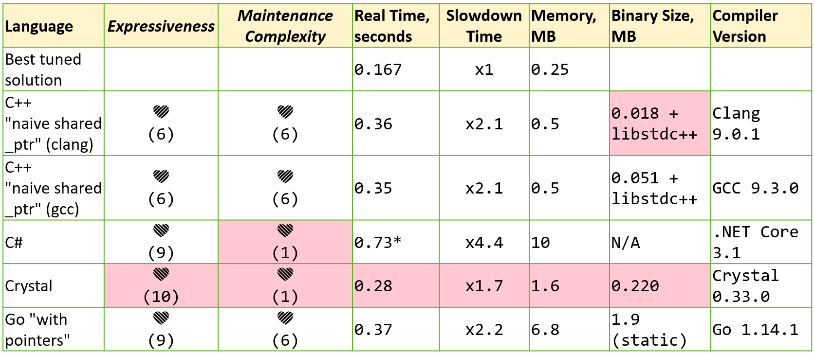
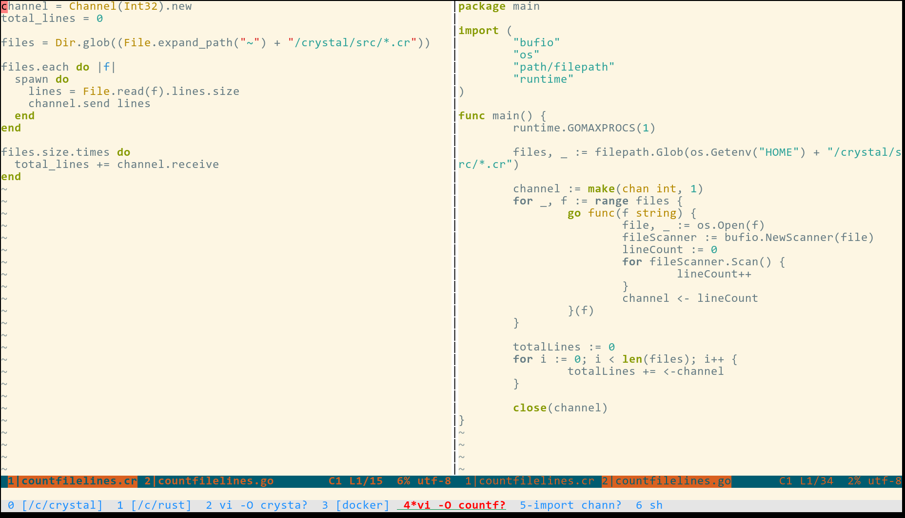
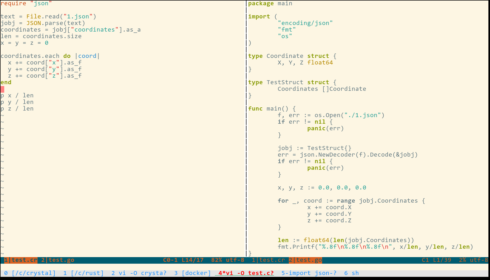
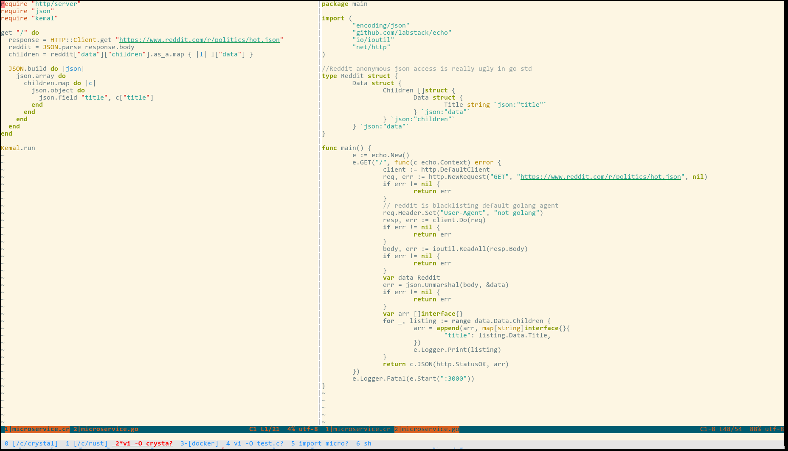

compass-ci采用了解耦架构设计，由几十个微服务、几十个工具脚本组成。各自形成一些几百行的小程序，方便分别理解。每个组件可以看情况选择合适的编程语言。
compass-ci.git当前约有1.1万行ruby, 6千行crystal, 6千行shell，基本跑在服务端。
lkp-tests.git当前约有3万行shell，2万行ruby，基本跑在测试机上和客户端。将来会有8千行ruby转crystal的stats解析逻辑跑在服务端。
测试机上的框架代码使用了/bin/sh脚本，以方便跑在内存受限系统上，如busybox。
LKP框架所调用的测试脚本，原则上可以用目标环境所支持的任何编程语言，一般以shell为主。

现在 python 这么火，那么 why not python?
服务端的语言选型，决定性因素在crystal vs go, 不在ruby vs python。
客户端的语言选型，来自于lkp-tests.git里shell/ruby历史遗产的继承。

服务端微服务代码，使用静态语言好处多多。除了高性能，更重要的是BUG少，安全稳定，便于理解、维护。
编译期的Null值检查、语法检查、类型匹配等可以有效拦截低级BUG上生产线。
动态语言ruby/python在运行到相关场景才能暴露出来的低级BUG，像海绵挤水，隔三差五绵绵不绝，是运维的噩梦。

静态语言里，go是云计算时代的当红语言，然而新兴语言crystal远比go适合compass-ci。

1) Compass CI的核心数据结构是job.yaml，其特点是动态性很强，不同job的结构与组合千变万化。
   go仅适合处理静态结构的YAML/JSON；而crystal的union类型特性，使得它可以像ruby/python一样优雅的处理动态YAML/JSON。

2) Compass CI的核心数据库是ElasticSearch，以便利用其优点: 动态结构jobs/hosts文档，自动索引，千维搜索。
   crystal的理想搭配是ElasticSearch，支持动态JSON；而go的理想搭配是mysql，静态table+静态struct。

3) lkp-tests历史遗产有大量ruby代码。而crystal完美继承了ruby语法和标准库。
   ruby+crystal的一致性体验极佳，转换容易，远胜python+go泾渭分明的组合。

4) crystal is better go
   两者都是GC语言，都支持协程，处于同一编程语言生态位。
   crystal可借力ruby生态，相比go性能略优，入门容易，表达力、可读性、可维护性大优。



crystal是理想的服务端语言，crystal/ruby是理想的语言组合。
需要高性能高安全的服务组件用crystal，追求便利性的小脚本用ruby。
如果某个ruby脚本将来成为性能瓶颈，改写成crystal比较方便。从这个意义上，ruby/crystal组合比python/go组合更为演进友好。

crystal一个很大的优点是写起来有脚本语言的体感，但是效率与go一样高。
ruby/crystal代码比较能体现程序员脑子里的设计意图。

	Ruby was the first language I learned that felt really fun.
	It didn't feel like I was fighting a rigid system to get things done,
	and I wasn't writing unnecessary glue code or helper methods everywhere.
	Ruby just works with my brain instead of getting in the way of it.

crystal写起来比go舒服很多，代码量也少。有利于开发者聚焦精力在业务逻辑上，节约研发成本。
以下是crystal vs go在三个场景下的对比。




crystal的union类型特性，使得它特别适合动态处理YAML/JSON文件。而我们的核心数据结构是job.yaml，所以用crystal处理会比较自然，而用go就很难。举例如下：

```ruby
require "json"

json = JSON.parse %<{"key": [1, 2, 3]}>
json["key"][1].to_i #=> 2
```

Compass CI项目里仅使用ruby/crystal的基本语法，不必学习tricky的高级特性。
ruby语法快速入门： https://learnxinyminutes.com/docs/ruby/
crystal语法类似： https://learnxinyminutes.com/docs/crystal/
				 https://getgood.at/in-a-day/crystal
ruby API的话，可以用ri命令查询，或者vscode自动提示。ruby高度面向对象，代码一致性很好，都是object.method()的API调用模式

https://www.zhihu.com/question/33311554/answer/1938414272
Crystal 语言是否值得看好？
