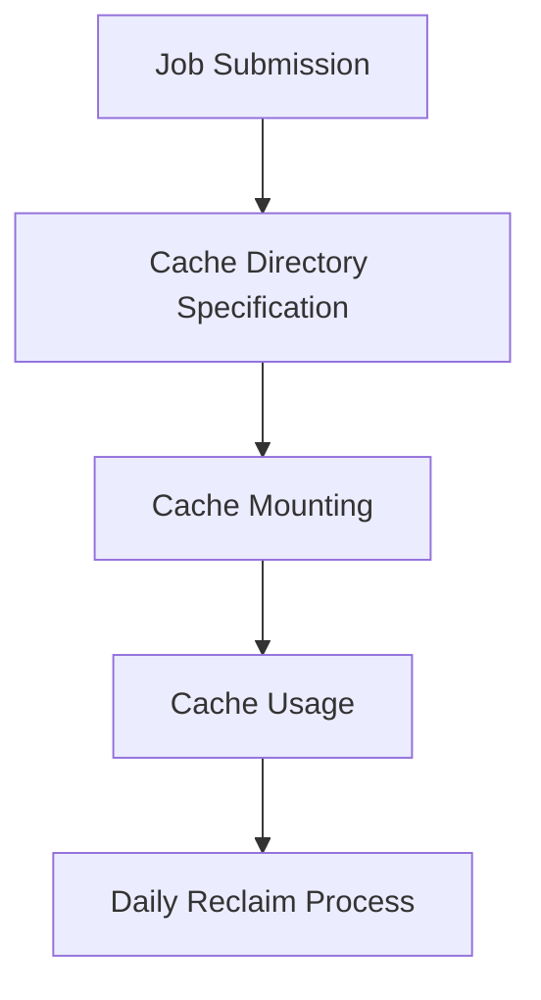

# Caching System Design Document

## Overview
This document describes the architecture and design of the caching system used in CI/CD pipelines for Compass-CI. The system manages two types of caches:
1. **Generic Cache (CACHE_DIR)**: For build artifacts (e.g., `1-git/linux`, `1-ccache/redis`)
2. **Package Cache (PACKAGE_CACHE_DIR)**: For OS-specific package repositories

## Architecture

### Key Components


### Core Flow
1. **Cache Declaration**: Jobs specify required cache directories in `job.yaml`
2. **Cache Mounting**:
   - Docker/QEMU providers mount cache directories to containers/VMs
   - Package cache mounted based on OS type (Debian/Ubuntu vs RHEL/Fedora)
3. **Cache Reclaim**:
   - Daily cleanup of old entries
   - Two-phase policy: Age-based + Disk utilization-based

## Directory Layout

### Typical Structure
```
BASE_DIR/provider/
├── cache/               # CACHE_DIR, mapped to /srv/cache/ inside testbox
│   ├── 1-git/           # Version control caches
│   │   └── linux/
│   ├── 1-ccache/        # Compiler caches
│   │   └── redis/
│   └── 1-othertype/...
└── pkgcache/            # PACKAGE_CACHE_DIR
    ├── debian@12/
    │   ├── archives/    # .deb packages
    │   └── lists/       # Repository metadata
    └── openeuler@20.03/
        └── *.solv       # DNF metadata and package files
```

## Reclaim Policies

### Policy Hierarchy
1. **Age-based Reclaim**:
   - Delete items older than 1 year (365 days)
2. **Utilization-based Reclaim**:
   - Remove oldest items until disk usage < 70%

### Reclaim Process
```ruby
def reclaim_combined_cache
  1. Collect all cache items
  2. Sort by modification time
  3. Delete items older than 1 year
  4. While disk utilization > 70%:
     a. Delete oldest remaining item
     b. Update disk metrics
end
```

## Cache Directory Structure: 1-9 Subdir Prefix

### Overview
The cache directory structure uses a numeric prefix (1, 2, .., up to 9) in level-1 subdirectory names to indicate the **depth and type of the cache layout**. This prefix helps organize cache directories and enables efficient reclaiming based on the directory hierarchy.

### Prefix Meaning
| Prefix | Depth | Example Layout | Description |
|--------|-------|----------------|-------------|
| **0**  | any     | `0-typeF/**/cache_file` | file cache. Reclaime old mtime based on `find -type f 0-typeF` |
| **1**  | 1     | `1-typeA/cache_item` | Single-level cache directories. Reclaime old mtime based on 1-typeA/* |
| **2**  | 2     | `2-typeB/cache_class/cache_item/` | Two-level cache directories. Reclaime old mtime based on 2-typeB/*/* |
| **3**  | 3     | `3-typeC/cache_class/cache_class2/cache_item/` | Three-level cache directories. Reclaime old mtime based on 3-typeC/*/*/*  |

### Example Layout
```
CACHE_DIR/
├── 0-download/         # FIle cache
│   ├── dir/to/file1    # File 1
│   ├── dir/to/to/file2 # File 2
├── 1-git/              # Level-1 cache
│   ├── repo1/          # Git repo1
│   ├── repo1/          # Git repo1
│   └── repo2/          # Git repo2
├── 1-ccache/           # Level-1 cache
│   ├── project1/       # Project 1 Compiler cache
│   └── project2/       # Project 2 Compiler cache
```

### Implementation in Code
The reclaiming logic uses the prefix to determine the depth of directories to reclaim:
```ruby
def collect_cache_dirs(cache_dir)
  cache_items = []
  Dir.glob("#{cache_dir}/*").each do |depth_type_dir|
    depth = File.basename(depth_type_dir).to_i
    case depth
    when 0
      cache_items += `find #{depth_type_dir} -type f`.split
    when 1
      cache_items += Dir.glob("#{depth_type_dir}/*") # Level-1
    when 2
      cache_items += Dir.glob("#{depth_type_dir}/*/*") # Level-2
    when 3
      cache_items += Dir.glob("#{depth_type_dir}/*/*/*") # Level-3
    ...
    when 9
      # supports up to 9 levels
    end
  end
  cache_items
end
```

### Benefits of the Prefix System
1. **Organization**:
   - Clear separation of cache types based on depth requirements.
2. **Efficient Reclaiming**:
   - Reclaiming logic can target specific directory depths.
3. **Scalability**:
   - Supports both simple and complex caching needs.
4. **Flexibility**:
   - New cache types can be added with appropriate depth prefixes.

### Best Practices
1. **Consistent Naming**:
   - Always use the numeric prefix to indicate depth.
2. **Depth Selection**:
   - Choose the minimum depth required for the cache type.
3. **Documentation**:
   - Document the depth requirement for each cache type in the system.

## Integration with Job System

### Job Configuration
Jobs must explicitly declare cache dependencies in `job.yaml`:
```yaml
cache_dirs:
  - 1-git/linux
  - 1-ccache/redis
```

### Provider Implementation
**Docker**:
```ruby
# Mount cache directories to container
env["cache_dirs"] = @message["cache_dirs"] if @message.include? "cache_dirs"
cmd += (-v "$CACHE_DIR:/srv/cache")
```

**QEMU**:
```bash
# VirtFS mounting for KVM
[ -n "$cache_dirs" ] && kvm+=(-virtfs local,path=$CACHE_DIR,mount_tag=9p/cache...)
```

## Key Use Cases

1. **CI/CD Pipeline Acceleration**
   - Reuse compiler caches (ccache) between jobs
   - Share git repositories across test runs

2. **Package Repository Mirroring**
   - Cache Debian/Ubuntu packages in `archives/`
   - Maintain Fedora/CentOS metadata in `*.solv` files

3. **Cross-job Artifact Sharing**
   - Share build artifacts between compilation and test jobs
   - Maintain persistent caches for long-running projects

## Important Cautions

### Race Conditions
1. **Concurrent Access**:
   ```ruby
   # Anti-pattern - use job-specific subdirectories: cannot be reused/shared at all
   cache_dirs: ["1-shared_cache/#{job_id}"]

   # Recommended - multiple jobs reusing same cache
   cache_dirs: ["1-shared_cache/#{project_name}"]

   # Recommended - in run script, use create-then-atomic-move, or call
   # lock_cache_dir()/release_cache_dir() for protecting concurrent writes
   ```
2. **Cache Identification**:
   - Use versioned directory names (e.g., `gcc-12.3/`) for distinct contents

### Security Considerations
1. **Permission Management**:
   ```ruby
   # Ensure proper umask for shared access
   File.umask(0000)
   FileUtils.mkdir_p(ENV["CACHE_DIR"])
   ```
2. **Sensitive Data**:
   - Never store secrets in cache directories
   - Enable encryption for sensitive artifact caches

## Implementation Notes

### Critical Code Locations
1. **Cache Initialization**:
   ```ruby
   # providers/multi-qemu-docker.rb
   FileUtils.mkdir_p(ENV["CACHE_DIR"] = "#{BASE_DIR}/provider/cache")
   FileUtils.mkdir_p(ENV["PACKAGE_CACHE_DIR"] = "#{BASE_DIR}/provider/pkgcache")
   ```

2. **Daily Reclaim**:
   ```ruby
   # providers/multi-qemu-docker.rb
   EM.add_periodic_timer(24*3600) { reclaim_cache_dirs(...) }
   ```

3. **Package Cache Handling**:
   ```bash
   # providers/docker/run.sh
   case "$os" in
     debian|ubuntu)
       mkdir -p $PACKAGE_CACHE_DIR/$osv/archives
       cmd+=(-v "$PACKAGE_CACHE_DIR/$osv/archives:/var/cache/apt/archives")
   ```

