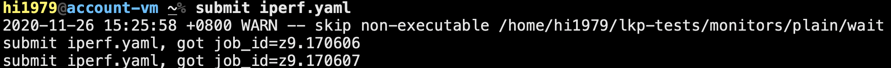
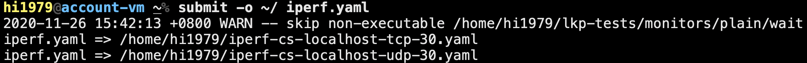
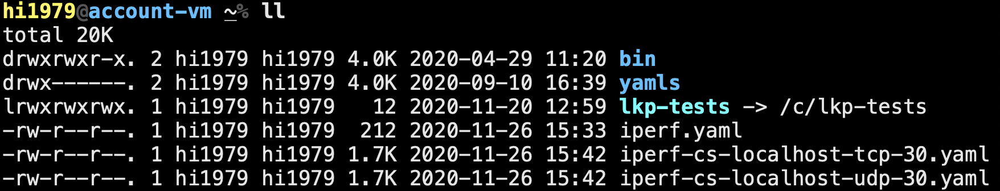

submit命令是我们提交测试任务最基本的方式，同时提供了很多辅助功能帮助我们更灵活的提交任务
在命令行直接输入submit命令可以查看帮助信息

### 基本用法
测试任务通过yaml的方式提交，所以使用submit命令时必须添加yaml文件
最基本的用法为：submit + yaml文件

### -s的用法：
使用-s参数可以将key value键值对更新到提交的任务当中
用法： -s + '键值对'
命令：submit -s 'testbox: vm-2p8g' iperf.yaml
1.如果iperf.yaml中不存在testbox：vm-2p8g，最终提交的任务将会加上该信息
2.如果iperf.yaml中存在testbox字段，但是值不为vm-2p8g，最终提交的任务将会被替换为vm-2p8g
### -o的用法：
使用-o命令可以将最终生成的yaml文件保存到指定目录下
用法：-o + 文件保存的目录
命令：submit -o ./ iperf.yaml

运行命令之后会在指定目录生成经过submit处理过的yaml文件

### -a的用法：
如果您需要适配自己的测试用例，请务必加参数-a，因为客户端的lkp-tests下做的更改，在服务端上的lkp-tests是无法实时同步上的，加了-a这个参数，客户端做的更改，才可以同步到服务端去，并且在测试机上生成你的测试脚本。
命令： submit -a iperf.yaml
### -m的用法：
使用-m参数可以启动任务监控功能，将会打印出任务执行过程中的各种状态信息
方便用户实时监控所提交的任务执行到哪个阶段
命令：submit -m iperf.yaml
效果如下：
  submit iperf.yaml, got job_id=z9.170614
  query=>{"job_id":["z9.170614"]}
  connect to ws://172.168.131.2:11310/filter
  {"job_id":"z9.170614","message":"","job_state":"submit","result_root":"/srv/result/iperf/2020-11-26/vm-2p8g/openeuler-20.03-aarch6
  {"job_id": "z9.170614", "result_root": "/srv/result/iperf/2020-11-26/vm-2p8g/openeuler-20.03-aarch64/tcp-30/z9.170614", "job_state
  {"job_id": "z9.170614", "job_state": "boot"}
  {"job_id": "z9.170614", "job_state": "download"}
  {"time":"2020-11-26 15:54:48","mac":"0a-ab-e5-da-a2-64","ip":"172.18.210.198","job_id":"z9.170614","state":"running","testbox":"vm
  {"job_state":"running","job_id":"z9.170614"}
  {"job_state":"post_run","job_id":"z9.170614"}
  {"start_time":"2020-11-26 07:53:45","end_time":"2020-11-26 07:54:15","loadavg":"1.17 0.36 0.13 1/109 1960","job_id":"z9.170614"}
  {"job_state":"finished","job_id":"z9.170614"}
  {"job_id": "z9.170614", "job_state": "complete"}
  {"time":"2020-11-26 15:55:26","mac":"0a-ab-e5-da-a2-64","ip":"172.18.210.198","job_id":"z9.170614","state":"rebooting","testbox":"}
  {"job_id": "z9.170614", "job_state": "extract_finished"}
  connection closed: normal
### -c的用法：
-c参数需要搭配-m参数来使用。
使用场景：申请设备的任务实现自动登入功能
命令：submit -m -c borrow-1h.yaml
当我们提交一个申请设备的任务后，会获取到返回的登陆信息，如：ssh ip -p port
添加-c参数之后不需要我们手动输入ssh登陆命令来进入执行机，效果如下所示:
  submit /home/wuzhende/code/lkp-tests/jobs/borrow-1h.yaml, got job_id=z9.143309
  query=>{"job_id":["z9.143309"]}
  connect to ws://localhost:11310/filter
  {"job_id":"z9.143309","message":"","job_state":"submit","result_root":"/srv/result/borrow/2020-11-26/vm-2p8g/openeuler-20.03-aarch
  {"job_id": "z9.143309", "result_root": "/srv/result/borrow/2020-11-26/vm-2p8g/openeuler-20.03-aarch64/3600/z9.143309", "job_state"
  {"job_id": "z9.143309", "job_state": "boot"}
  {"job_id": "z9.143309", "job_state": "download"}
  {"time":"2020-11-26 18:42:38","mac":"0a-f7-47-0e-19-12","ip":"172.18.16.158","job_id":"z9.143309","state":"running","testbox":"vm-
  {"job_state":"running","job_id":"z9.143309"}
  {"job_id": "z9.143309", "state": "set ssh port", "ssh_port": "51170", "tbox_name": "vm-2p8g.wuzhende-2252124"}
  Host 172.168.131.113 not found in /home/wuzhende/.ssh/known_hosts
  Warning: Permanently added '[172.168.131.113]:51170' (ECDSA) to the list of known hosts.
  Last login: Wed Sep 23 11:10:58 2020

  Welcome to 4.19.90-2003.4.0.0036.oe1.aarch64

  System information as of time:  Thu Nov 26 18:42:40 CST 2020

  System load:    1.53
  Processes:      105
  Memory used:    6.1%
  Swap used:      0.0%
  Usage On:       89%
  IP address:     172.17.0.1
  Users online:   1

  root@vm-2p8g ~#
已经成功登陆执行机
### 总结
以上即为submit各种参数的用法解释，您可以根据您的实际需求灵活搭配。
