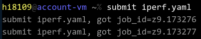
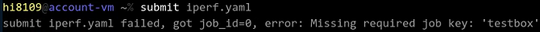
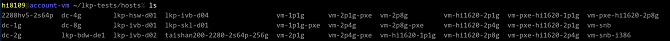
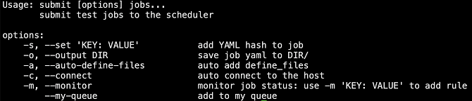
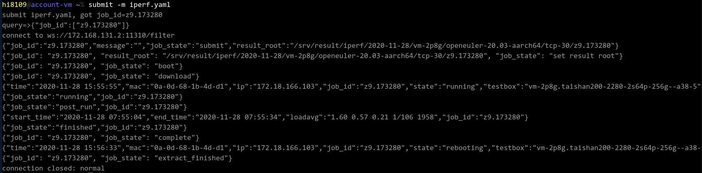

# submit 命令详解

### 概述

submit 命令的作用是提交测试任务。该命令提供了多个选项帮助用户更灵活的提交任务，您可以在命令行直接输入 summit 命令来查看帮助信息，并根据实际需求灵活使用。


### 基本用法

测试任务以 yaml 文件的方式提交，因此，您需要事先准备好测试任务的 yaml 文件（本文以 iperf.yaml 为例）。使用如下命令提交测试任务：

```
submit iperf.yaml
```
如下图所示：



本文所示的 yaml 文件均已添加 testbox 字段，若您提交的 yaml 文件不包含该字段将报错：



您可以在 yaml 文件中添加 testbox 字段，或使用如下命令：

```
submit iperf.yaml testbox=vm-2p8g
```

testbox 字段的值指定需要的测试机，可以使用 `ls` 命令查看 `lkp-tests/hosts` 路径下的可选测试机。如下图所示：



> **说明：** 
>
>使用 "=" 更新 yaml 中的字段，"=" 在命令行中的位置不同优先级不同：.
> * submit iperf.yaml testbox=vm-2p8g  命令中 "=" 定义在 yaml 文件之后，则 "=" 的优先级高于 yaml 文件,testbox=vm-2p8g 会覆盖 yaml 文件中已经定义的 testbox 字段。
> * submit testbox=vm-2p8g iperf.yaml  命令中 "=" 定义在 yaml 文件之前，则 "=" 的优先级低于 yaml 文件,testbox=vm-2p8g 不会覆盖 yaml 文件中已经定义的 testbox 字段，只有当 yaml 文件中不存在 testbox 字段才会赋值。


### 高级用法

submit 命令的选项如下图所示：




* **-s的用法**

    使用 -s 'KEY:VALUE' 参数可以将键值对更新到提交的任务当中。示例如下所示：
    ```
    submit -s 'testbox: vm-2p8g' iperf.yaml
    ```
	

    * 如果 iperf.yaml 中不存在 testbox：vm-2p8g ，最终提交的任务将会加上该信息。
    * 如果 iperf.yaml 中存在 testbox 字段，但是值不为 vm-2p8g ，最终提交的任务中 testbox 的值将会被替换为vm-2p8g。

* **-o的用法**

    使用-o DIR 命令可以将最终生成的yaml文件保存到指定目录 DIR 下。示例如下所示：

    ```
    submit -o ~/iperf.yaml
    ```

    运行命令之后会在指定目录生成经过 submit 处理过的 yaml 文件。
	
* **-a的用法**

    如果你的测试用例对客户端的lkp-tests 做了更改，需要使用 -a 选项来适配。将客户端的 lkp-tests 下做的更改，同步到服务端，并在测试机上生成你的测试脚本。
    示例命令如下：
	
    ```
    submit -a iperf.yaml
    ```

* **-m的用法**

    使用 -m 参数可以启动任务监控功能，并将任务执行过程中的各种状态信息打印到控制台上，方便用户实时监控测试任务的执行过程。
    示例命令如下：
	
    ```
    submit -m iperf.yaml
    ```
    
    控制台显示如下：
	
    


* **-c的用法**

    -c 参数需要搭配 -m 参数来使用，可以使申请设备的任务实现自动登入功能。

    示例命令如下：
	
    ```
    submit -m -c borrow-1h.yaml
    ```
    当我们提交一个申请设备的任务后，会获取到返回的登陆信息，如 `ssh ip -p port`，添加 -c 参数之后不需要我们手动输入 ssh 登陆命令来进入执行机。

	控制台显示如下：
	
     

    已经成功登陆执行机。

