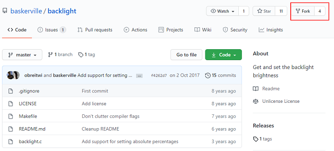

# How Do I Use the Compass-CI Platform to Test Open Source Projects?

This document describes how to use the Compass-CI platform to test open source projects.

### Adding the URL of the Repository to Be Tested to the upstream-repos Repository

Perform the following steps to add the information of the code repository to be tested to the **upstream-repos** repository (https://gitee.com/wu_fengguang/upstream-repos) in YAML format:

1. Fork the upstream-repos repository and clone it to the local host. This document uses the **backlight** repository (https://github.com/baskerville/backlight) as an example.



2. Run the following command to create a file path named with the repository name and its initial letter:

   ```
   mkdir -p b/backlight
   ```

3. Run the following command to create the **backlight** file in the directory:

   ```
   cd b/backlight
   touch backlight
   ```

4. Run the following command to write the URL of the **backlight** repository to the **backlight** file:

   ```
   vim backlight
   ```

   The format is as follows:

   ```
   ---
   url:
   - https://github.com/baskerville/backlight
   ```

   >  **Note**
   >
   > You can refer to the existing file format in the **upstream-repos** repository. Ensure that the formats are consistent.

5. Run the **Pull Request** command to submit the new **backlight** file to the **upstream-repos** repository.

### Submitting the Test Task to the Compass-CI Platform

1. Prepare a test case.

   You can compile and add a test case to the **lkp-tests** repository, or directly use the existing test cases in the **jobs** directory of the **lkp-tests** repository (https://gitee.com/wu_fengguang/lkp-tests).

   * Use the test cases that have been adapted in the repository.

     Use the test cases in the **lkp-tests** repository that meet the requirements. The **iperf.yaml** file is used as an example. The **iperf.yaml** file is a test case that has been adapted. It is stored in the **jobs** directory of the **lkp-tests** repository, and contains some basic test parameters.

   * Compile a test case and add it to the repository.

     For details, see [How To Add Test Cases](https://gitee.com/wu_fengguang/lkp-tests/blob/master/doc/add-testcase.md).

2. Configure **DEFAULTS** files in **upstream-repos** repository and submit the test task.

   You only need to add **DEFAULTS** file in the directory of file **backlight** we referred to above, and configure it like:

 ```
  submit:
  - command: testbox=vm-2p16g os=openeuler os_version=20.03 os_mount=cifs os_arch=aarch64 api-avx2neon.yaml
    branches:
    - master
    - next
  - command: testbox=vm-2p16g os=openeuler os_version=20.03 os_mount=cifs os_arch=aarch64 other-avx2neon.yaml
    branches:
    - branch_name_a
    - branch_name_b

 ```

   Submit the modified **DEFAULTS** file to the **upstream-repos** repository using Pull Request. Then you can use the Compass-CI platform to test your project.

   For details about how to configure DEFAULTS files, see https://gitee.com/wu_fengguang/upstream-repos/blob/master/README.md.

   For meaning and effect of parameters in the command, see https://gitee.com/wu_fengguang/compass-ci/tree/master/doc/job.
