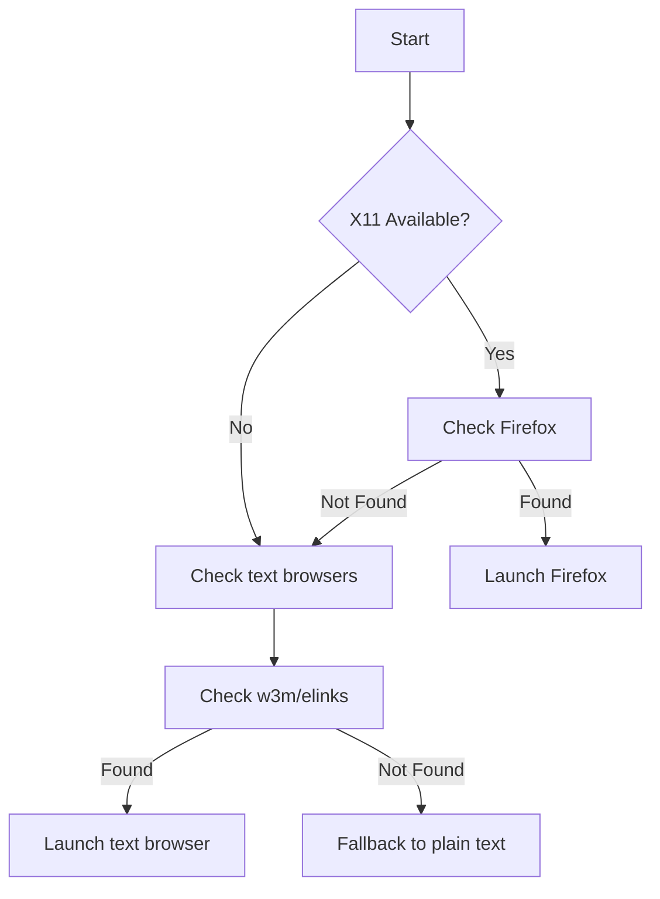

# Host Dashboard API Documentation

Endpoint: `GET /scheduler/v1/dashboard/hosts`

## Overview
Interactive dashboard for monitoring host machines with real-time filtering, sorting, and multi-format output capabilities.

## Features
- Dual output formats: HTML (browser-friendly) & plain text (console-friendly)
- Auto-refresh every 10 seconds (HTML only)
- Multi-criteria filtering with visual counters
- Conditional coloring for critical metrics
- Column sorting via clickable headers
- Field selection customization
- Load level filtering (heavy/medium/light)
- Text client support (w3m/elinks)

## Query Parameters

| Parameter   | Values                     | Description                     |
|-------------|----------------------------|---------------------------------|
| `arch`      | x86_64, aarch64            | CPU architecture filter         |
| `tbox_type` | qemu, container, etc       | Testbox type filter             |
| `is_remote` | true/false                 | Remote host filter              |
| `has_job`   | true                       | Hosts with active jobs          |
| `load`      | heavy/medium/light         | System load filter              |
| `fields`    | comma-list                 | Custom columns (see field list below) |
| `sort`      | field_name                 | Sort column                     |
| `order`     | asc/desc                   | Sort direction                  |
| `output`    | html/text                  | Force output format             |

## Available Fields
```plaintext
hostname
arch
nr_cpu
nr_disks
nr_vm
nr_container
tbox_type
is_remote
boot_time
active_time
reboot_time
uptime_minutes

job_id
suite
my_account

freemem
freemem_percent
disk_max_used_percent
cpu_idle_percent
cpu_iowait_percent
cpu_system_percent
disk_io_util_percent
network_util_percent
network_errors_per_sec
```

## Usage Examples

**Basic HTML Request**
```bash
curl http://localhost:3000/scheduler/v1/dashboard/hosts
```

**Text Output with Custom Columns**
```bash
curl http://localhost:3000/scheduler/v1/dashboard/hosts?output=text&fields=hostname,arch,load
```

**Filtered Request**
```bash
curl "http://localhost:3000/scheduler/v1/dashboard/hosts?arch=x86_64&load=heavy&has_job=true"
```

**Sorted Results**
```bash
curl "http://localhost:3000/scheduler/v1/dashboard/hosts?sort=freemem_percent&order=desc"
```

## Client Usage
```bash
# Interactive browser mode
./dashboard.rb --fields=hostname,arch,cpu_idle_percent --order-by=freemem_percent:desc

# Console mode
./dashboard.rb --viewer=text arch=x86_64 load=heavy
```

## Response Formats

**HTML Features**
```html
<!-- Auto-refresh meta tag -->
<meta http-equiv="refresh" content="10">

<!-- Interactive filter controls -->
<form method="get">
  <div class="filter-group">
    <strong>Arch:</strong>
    <label><input type="checkbox" name="arch" value="x86_64"> x86_64 (42)</label>
    <label><input type="checkbox" name="arch" value="aarch64"> aarch64 (15)</label>
  </div>
  
  <!-- Sortable headers -->
  <th><a href="?sort=hostname&order=asc">Hostname</a></th>
</form>
```

**Text Output**
```plaintext
hostname  arch     freemem_percent  cpu_iowait_percent
node01    x86_64   25%              18%
node02    aarch64  45%              5% 
```

## Implementation Notes
1. **Data Pipeline**
   - Filter → Sort → String Conversion → Render
   - All values converted to strings before rendering

2. **Performance**
   - Typical response time: <2ms
   - Cached host data with incremental updates

3. **Security**
   - XSS protection via automatic HTML escaping
   - Input validation for sort/filter parameters

4. **Metrics Coloring**
   - **Freemem**: <20% (red), 20-40% (orange), >40% (green)
   - **Disk Space Usage**: >90% (red), 80-90% (orange)
   - **IO Wait**: >=10% (red), 2-9% (orange)

## Client Detection Logic

