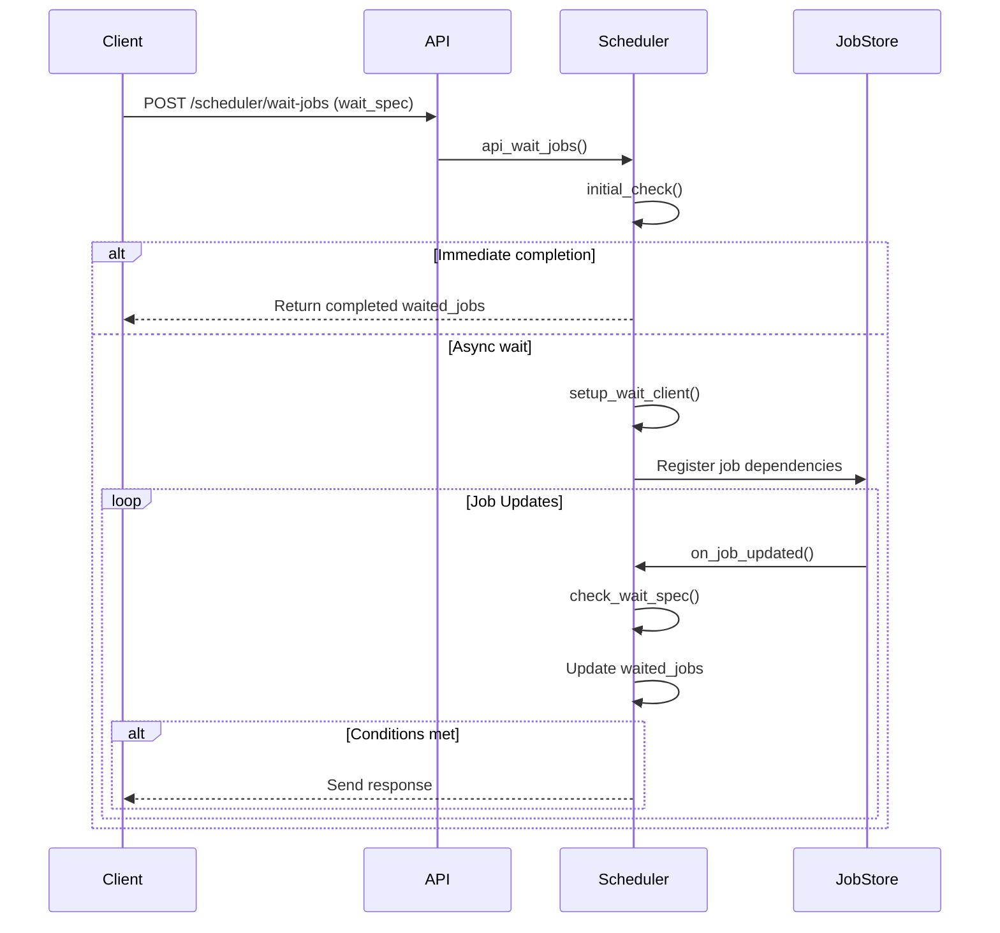

# Design Document: Job Waiting System

## 1. Overview
The system provides a mechanism for clients to wait for job completion while supporting:
- Complex wait conditions
- Result field collection
- Fail-fast error handling
- Asynchronous notifications

## 2. Key Components

### 2.1 Data Structures
```crystal
# Example input wait spec
{
  "wait_on" => {
    "job123" => {"job_stage" => "complete"},
    "job456" => nil # Default to completion check
  },
  "wait_options" => {
    "get_fields" => {"job_health": nil},
    "fail_fast" => nil
  },
  "waited_jobs" => {
    "job789" => {"job_stage" => "complete", "job_health" => "success"}
  }
}
```

### 2.2 Core Flow
1. Client submits wait specification via API
2. System registers wait conditions
3. Job updates trigger dependency checks
4. Matched jobs populate result fields
5. Client receives response when all conditions met or fail-fast triggered

## 3. Component Interactions



# API Documentation: POST /scheduler/wait-jobs

## Request
```http
POST /scheduler/wait-jobs
Content-Type: application/json
```

### Request Body (JSON)
```json
{
  "wait_on": {
    "<job_id>": {
      "<field1>": "<expected_value1>",
      "<field2>": "<expected_value2>"
    },
    ...
  },
  "wait_options": {
    "get_fields": {
      "<fieldA>": null,
      "<fieldB>": null
    },
    "fail_fast": null
  }
}
```

| Field | Type | Description |
|-------|------|-------------|
| wait_on | HashHH | Required. Map of job IDs to their required conditions |
| wait_options | HashHH | Optional. Additional processing instructions |
| get_fields | HashH | Optional. Fields to collect from completed jobs |
| fail_fast | null | Optional. Flag to abort on first incomplete job |

## Response
```json
{
  "waited_jobs": {
    "<completed_job_id>": {
      "job_stage": "<stage_name>",
      "<requested_field1>": "<value1>",
      "<requested_field2>": "<value2>"
    },
    ...
  }
}
```

## Examples

### Basic Usage
**Request:**
```json
{
  "wait_on": {
    "job123": {"job_stage": "complete"},
    "job456": null
  }
}
```

**Response:**
```json
{
  "waited_jobs": {
    "job123": {"job_stage": "complete"},
    "job456": {"job_stage": "complete"}
  }
}
```

### Advanced Usage
**Request:**
```json
{
  "wait_on": {
    "job789": {
      "milestone": "final"
    }
  },
  "wait_options": {
    "get_fields": {
      "result_root": null,
      "boot_seconds": null
    },
    "fail_fast": null
  }
}
```

**Response:**
```json
{
  "waited_jobs": {
    "job789": {
      "job_stage": "complete",
      "result_root": "/result/...",
      "boot_seconds": "45"
    }
  }
}
```

## Behavior Details

### 1. Field Matching
- Special fields:
  - `job_stage`: Compares using stage ordering
  - `milestones`: Checks array inclusion
- Regular fields: Exact string match
- Empty condition (`null`): Default completion check

### 2. Fail-Fast Behavior
- Triggers when any job reaches "incomplete" stage
- Immediately returns current results
- Clears remaining wait conditions

### 3. Result Collection
- Always includes `job_stage` field
- When no more `wait_on` field, all wait done
- Collects requested fields from:
  - `hash_plain` (primary)
  - `hash_array` (string joined by " ")
  - `hash_h` (json string)
  - Empty string if not found

