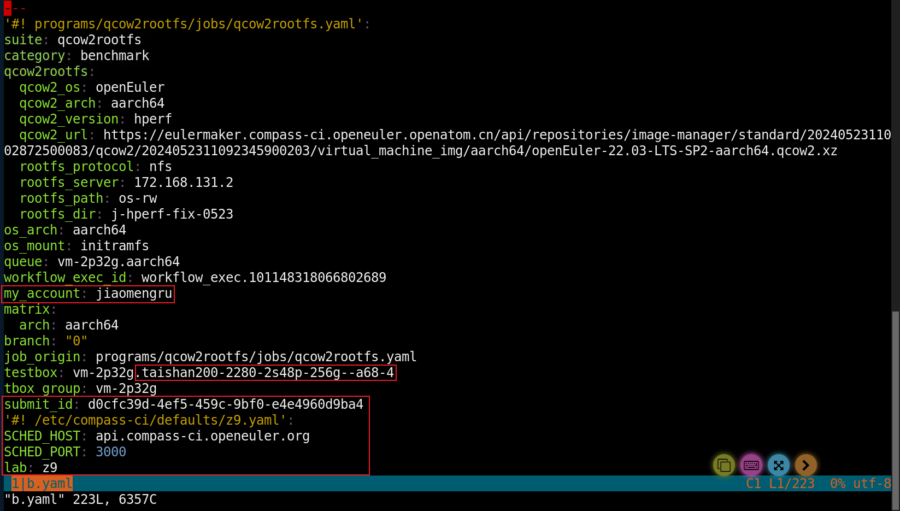

# 环境复现

1、查看 es 数据库，并切换到 result_root 的目录

> ee 命令的配置方法见 FAQ

```bash
ee z9.27563246
# 或
# es-find _id=z9.27563246 | grep result
# cd result_root
```

2、复制 job.yaml 并编辑

```bash
cp job.yaml a.yaml
vi a.yaml
# 删除submit_id: xxx及之后的所有内容（删除某行后所有内容快捷键 ESC d G）
# 删除testbox: vm-2p32g后的物理机信息（删除某行剩余内容快捷键 i CTRL+k）
# 如果非本人提交job，删除my_account
```



3、修改 lkp-tests 中 run 脚本

```bash
# 确定环境中使用的lkp-tests
echo $LKP_SRC
# 切换到测试套目录
cd $LKP_SRC/programs/qcow2rootfs(xxx测试套)
vi run
# 在run脚本中添加sleep语句，使任务执行完毕后不立即退出
```

4、打包

```bash
cd ~/lkp-tests/sbin
do-local-pack
# 查看修改的代码是否打包成功
cd ~/.cache/lkp/LKP_SRC/lkp/lkp/src/programs/qcow2rootfs
vi run
```

5、提交 a.yaml

```bash
# submit -h 帮助
# 提交方式推荐使用
submit -m -c a.yaml -i borrow-1d.yaml LKP_DEBUG=2
# 等待几分钟后自动进入虚拟机
# 显示所有当前运行的进程的详细信息
ps -ef
```

> 如果提交 job 出现错误：submit a.yaml failed, got job id=0, error: Missing required job key: 'my_email'.
>
> 为 z9 账号未配置 account.yaml 信息，配置方法见 FAQ


# FAQ

## 一、z9 配置默认 yaml 文件

1、账号申请

https://gitee.com/wu_fengguang/compass-ci/blob/master/doc/user-guide/apply-account.zh.md

2、从 Gitee 上的仓库 compass-ci/lkp-tests 克隆代码库

```bash
git clone https://gitee.com/compass-ci/lkp-tests.git
```

3、生成公私钥

```bash
ssh-keygen -t rsa
ls ~/.ssh
```

4、配置本地环境

```bash
# 查看build-my-info的帮助信息
# cd /c/compass-ci
# find ./ | grep build | grep info
build-my-info -h
# 查看账号信息
# 例：extract-account-info -e test@123.com -t
extract-account-info -e my_email -t
# 配置本地环境
# 例：build-my-info -e test@123.com -a test -n test -l z9 -k ~/.ssh/id_rsa.pub
build-my-info -e my_email -a my_account -n my_name -l lab -k ~/.ssh/id_rsa.pub
cd ~/.config/compass-ci/defaults
cat account.yaml
cat ../include/lab/z9.yaml
echo $LKP_SRC
```


## 二、配置自定义的 ee 命令

1、创建一个新的Shell脚本文件，并在该文件中输入自定义命令逻辑

```bash
vi ee.sh
```

```bash
ee () {
		cd /srv/$(es-find id=$1 | grep result_root | awk -F'"' '{print $4}')
}
```

2、为该脚本添加执行权限

```bash
chmod +x ee.sh
```

3、在 zsh 中加载存储有 ee 函数的脚本文件

```bash
# 打开.zshrc文件
vi ~/.zshrc
# 在文件中添加一行来加载包含ee函数定义的脚本文件
source /path/to/ee.sh
# 重新加载文件以使更改生效
source ~/.zshrc
```

4、使用

```bash
# 例
ee z9.27563246
```
